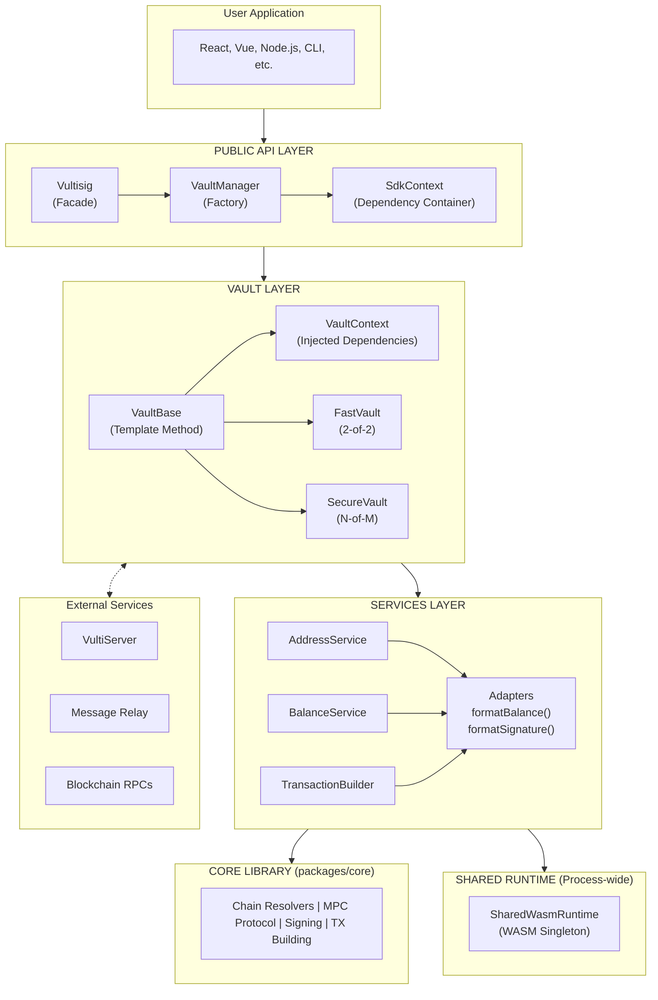

# Vultisig SDK Architecture

---

## Table of Contents

1. [Overview](#overview)
2. [Architecture Principles](#architecture-principles)
3. [Monorepo Structure](#monorepo-structure)
4. [SDK Package Structure](#sdk-package-structure)
5. [Core Components](#core-components)
6. [Vault System](#vault-system)
7. [Platform Support](#platform-support)
8. [Services](#services)
9. [Events System](#events-system)
10. [Type System](#type-system)
11. [Data Flow](#data-flow)
12. [Chain Support](#chain-support)
13. [Rujira Package](#rujira-package)

---

## Overview

The Vultisig SDK is a TypeScript library for creating and managing multi-chain cryptocurrency vaults using threshold signature schemes (TSS). It provides a unified interface for interacting with 40+ blockchain networks through multi-party computation (MPC), working seamlessly across browser and Node.js environments.

### What It Does

- **Vault Management** - Create, import, and manage cryptocurrency vaults
- **Multi-Chain Support** - Unified API for Bitcoin, Ethereum, Solana, and 40+ other chains
- **MPC Signing** - Secure transaction signing using threshold signatures
- **Balance Tracking** - Query native and token balances across all chains
- **Address Derivation** - Generate addresses for any supported chain
- **Gas Estimation** - Get current gas prices and fee estimates
- **Cross-Platform** - Works in browser and Node.js (Electron, React Native coming soon)

### Architecture Overview

The SDK follows a layered architecture:

1. **Public API Layer** - User-facing interfaces (`Vultisig`, `index.ts`)
2. **Vault Layer** - Vault hierarchy (`VaultBase`, `FastVault`, `SecureVault`)
3. **Services Layer** - Business logic services (signing, caching, balances)
4. **Platform Layer** - Platform-specific implementations (storage, WASM, crypto)

**Design Philosophy:** The SDK is a thin layer over the Vultisig Core library, using functional adapters to convert between Core's data formats and user-friendly SDK types. All blockchain logic lives in Core - the SDK focuses on providing excellent developer experience.

### Architecture Diagram



### Design Patterns Summary

| Pattern                | Component            | Purpose                                    |
| ---------------------- | -------------------- | ------------------------------------------ |
| **Facade**             | `Vultisig`           | Simple entry point hiding complexity       |
| **Factory**            | `VaultManager`       | Creates appropriate vault types            |
| **Template Method**    | `VaultBase`          | Common vault behavior with extension points|
| **Strategy**           | `FastVault`/`SecureVault` | Interchangeable signing strategies    |
| **Dependency Injection** | `SdkContext`/`VaultContext` | Instance-scoped, testable services |
| **Adapter**            | `formatBalance()` etc| Converts Core types to SDK types           |
| **Singleton**          | `SharedWasmRuntime`  | Process-wide WASM modules (intentional)    |
| **Observer**           | Event emitters       | Reactive state updates                     |

### Platform Bundles

The SDK supports multiple JavaScript environments through separate build-time bundles. Each bundle includes platform-specific implementations for storage, WASM loading, and crypto operations:

| Bundle                      | Platform         | Storage      | Use Case                |
| --------------------------- | ---------------- | ------------ | ----------------------- |
| `index.node.cjs`            | Node.js (CJS)    | Filesystem   | CommonJS environments   |
| `index.node.esm.js`         | Node.js (ESM)    | Filesystem   | Server-side, CLI tools  |
| `index.browser.js`          | Browser          | IndexedDB    | Web applications        |

Users import the appropriate bundle for their platform - the SDK API remains identical across all bundles.

**Coming Soon:** Electron (main/renderer) and React Native platform bundles.

---

## Architecture Principles

### 1. Functional Adapter Pattern

The SDK uses functional adapters to convert between Core's data formats and user-friendly SDK types, with minimal abstraction layers.

```typescript
// Vault calls Core functions directly
class VaultBase {
  async balance(chain: string): Promise<Balance> {
    // 1. Call Core directly
    const rawBalance = await getCoinBalance({ chain, address });

    // 2. Format with adapter
    return formatBalance(rawBalance, chain);
  }
}
```

**Key characteristics:**

- Direct Core integration (no wrapper services)
- Adapters are pure formatting functions
- All blockchain logic delegated to Core
- SDK focuses on caching, events, and coordination

### 2. Platform Agnostic

The SDK works seamlessly across all JavaScript environments through platform-specific bundles:

- **Browser** - IndexedDB storage, browser crypto
- **Node.js** - Filesystem storage, native crypto

*Coming soon: Electron and React Native support.*

### 3. Type-Safe Events

All events are type-safe through generics, ensuring compile-time safety for event names and payloads:

```typescript
interface VaultEvents {
  balanceUpdated: { chain: string; balance: Balance };
  transactionSigned: { chain: string; txHash: string };
}

vault.on("balanceUpdated", ({ chain, balance }) => {
  // TypeScript knows the exact payload shape
});
```

### 4. Smart Caching Strategy

Intelligent caching based on data mutability:

- **Addresses:** Permanent cache (deterministic, never change)
- **Balances:** 5-minute TTL (change frequently)
- **Gas prices:** No cache (highly volatile)

---

## Monorepo Structure

```
vultisig-sdk/
├── packages/
│   ├── sdk/                    # Main SDK (@vultisig/sdk)
│   ├── rujira/                 # Rujira DEX integration (@vultisig/rujira), includes asset registry
│   ├── core/                   # Upstream core library (read-only)
│   └── lib/                    # WASM bindings (dkls, schnorr)
├── clients/
│   └── cli/                    # CLI application
├── examples/
│   └── browser/               # Browser example (React/Vite)
├── .config/                   # Shared configuration
├── scripts/                   # Build and utility scripts
└── docs/                      # Documentation
```

### Package Relationships

- **`@vultisig/sdk`** - The main SDK package users install
- **`@vultisig/rujira`** - Rujira DEX integration (FIN swaps, deposits, withdrawals on THORChain), includes asset registry
- **`packages/core`** - Chain implementations, MPC protocol, signing logic (synced from upstream)
- **`packages/lib`** - WASM bindings (dkls, schnorr) - synced from upstream

---

## SDK Package Structure

```
packages/sdk/src/
├── index.ts                    # Public API exports
├── Vultisig.ts                 # Main SDK class
├── VaultManager.ts             # Vault lifecycle management
├── AddressBookManager.ts       # Address book functionality
├── constants.ts                # SDK constants
│
├── context/                    # Dependency injection
│   ├── SdkContext.ts          # SDK-level context interface
│   ├── SdkContextBuilder.ts   # Context factory function
│   ├── SharedWasmRuntime.ts   # Process-wide WASM singleton
│   └── index.ts
│
├── vault/                      # Vault implementation
│   ├── VaultBase.ts           # Abstract base vault class
│   ├── FastVault.ts           # 2-of-2 server-assisted vault
│   ├── SecureVault.ts         # Multi-device MPC vault
│   ├── VaultError.ts          # Error types
│   ├── VaultContext.ts        # Vault-level context interface
│   ├── services/              # Vault-specific services
│   │   ├── AddressService.ts      # Address derivation
│   │   ├── BalanceService.ts      # Balance fetching & caching
│   │   ├── GasEstimationService.ts # Gas/fee estimation
│   │   ├── TransactionBuilder.ts   # TX preparation
│   │   ├── BroadcastService.ts     # TX broadcasting
│   │   ├── PreferencesService.ts   # User preferences
│   │   └── cosmos/                # Cosmos-specific helpers
│   │       ├── buildCosmosPayload.ts  # SignAmino/SignDirect builders
│   │       └── index.ts
│   └── utils/
│       └── convertSignature.ts # Signature conversion
│
├── platforms/                  # Platform-specific implementations
│   ├── node/                  # Node.js platform
│   │   ├── index.ts
│   │   ├── storage.ts
│   │   ├── crypto.ts
│   │   ├── wasm.ts
│   │   └── polyfills.ts
│   ├── browser/               # Browser platform
│   ├── electron-main/         # Electron main process (coming soon)
│   ├── electron-renderer/     # Electron renderer (coming soon)
│   ├── react-native/          # React Native (coming soon)
│   └── types.ts               # Platform type definitions
│
├── server/                    # Server communication
│   ├── ServerManager.ts       # Server coordination logic
│   └── index.ts
│
├── services/                  # SDK-wide services
│   ├── CacheService.ts        # TTL-based caching (instance-scoped)
│   ├── FastSigningService.ts  # Server-assisted signing
│   ├── FiatValueService.ts    # Fiat value lookups
│   ├── PasswordCacheService.ts # Password caching (instance-scoped)
│   ├── cache-types.ts
│   └── index.ts
│
├── storage/                   # Storage abstraction
│   ├── MemoryStorage.ts       # In-memory implementation
│   ├── types.ts               # Storage interfaces
│   └── index.ts
│
├── events/                    # Event system
│   ├── EventEmitter.ts        # UniversalEventEmitter class
│   ├── types.ts               # Event type definitions
│   └── index.ts
│
├── config/                    # Configuration
│   └── index.ts               # SdkConfig type definitions
│
├── adapters/                  # Data format conversion
│   ├── formatBalance.ts       # bigint → Balance
│   ├── formatGasInfo.ts       # FeeQuote → GasInfo
│   ├── formatSignature.ts     # KeysignSignature → Signature
│   ├── getChainSigningInfo.ts # Chain signing metadata
│   └── index.ts
│
├── wasm/                      # WebAssembly types
│   ├── types.ts               # WasmConfig, WasmProvider interfaces
│   └── index.ts
│
├── crypto/                    # Cryptographic utilities
│   └── index.ts
│
├── utils/                     # General utilities
│   ├── validation.ts          # Input validation
│   ├── export.ts              # Vault export/import
│   └── memoizeAsync.ts        # Async memoization
│
└── types/                     # Type definitions
    └── index.ts               # SDK types and Core re-exports
```

---

## Core Components

### Vultisig Class

**File:** `src/Vultisig.ts`

The main SDK class that orchestrates all functionality using the facade pattern.

```typescript
import { Vultisig, Chain } from "@vultisig/sdk";

// Storage defaults to FileStorage (Node) or BrowserStorage (browser)
const sdk = new Vultisig({
  defaultChains: [Chain.Bitcoin, Chain.Ethereum],
});

await sdk.initialize();

// Create a fast vault - returns vaultId
const vaultId = await sdk.createFastVault({
  name: "My Vault",
  password: "secure-password",
  email: "user@example.com"
});

// Verify with email code to get the vault
const code = await getVerificationCode();
const vault = await sdk.verifyVault(vaultId, code);

// Get vault address
const address = await vault.address("Ethereum");

// Clean up when done
sdk.dispose();
```

**Responsibilities:**

- SDK initialization and lifecycle management
- Vault creation and management delegation
- Storage integration and persistence
- Event emission for SDK-level state changes
- Address book operations
- Resource cleanup via `dispose()`

**Key Dependencies (via SdkContext):**

- `VaultManager` - Vault operations
- `AddressBookManager` - Address book
- `ServerManager` - Server communication (instance-scoped)
- `SdkConfig` - Configuration (instance-scoped)
- `Storage` - Data persistence (injected)
- `PasswordCacheService` - Password caching (instance-scoped)
- `WasmProvider` - WASM module access

### VaultManager Class

**File:** `src/VaultManager.ts`

Internal class that manages vault lifecycle and vault collection. Users interact with vaults through the `Vultisig` facade.

```typescript
// Create fast vault (2-of-2 with server) - via Vultisig facade
const { vault } = await sdk.createFastVault({
  name: "My Vault",
  password: "secure-password",
  email: "user@example.com"
});

// Import existing vault
const vault = await sdk.importVault(vultFile, password);

// Export vault
const { filename, data } = await vault.export(password);
```

**Responsibilities:**

- Vault import from .vult files
- Vault storage and retrieval
- Active vault tracking
- Vault type detection

### Context-Based Architecture

The SDK uses **instance-scoped dependency injection** for clean separation and testability. Each SDK instance has its own isolated context:

**SdkContext** - Container for SDK-level dependencies:
- `storage` - Data persistence (required, injected)
- `config` - SDK configuration (instance-scoped)
- `serverManager` - VultiServer and relay communication (instance-scoped)
- `passwordCache` - Password caching service (instance-scoped)
- `wasmProvider` - Interface to WASM modules

**VaultContext** - Container for vault-level dependencies:
- `storage` - Inherited from SdkContext
- `config` - Inherited from SdkContext
- `serverManager` - Inherited from SdkContext
- `passwordCache` - Inherited from SdkContext
- `wasmProvider` - Inherited from SdkContext

**SharedWasmRuntime** - The only intentional process-wide singleton:
- WASM modules are expensive to load (~10MB total)
- Stateless after initialization
- Safe to share across SDK instances
- Configured automatically by platform bundles

```typescript
// Creating isolated SDK instances
const sdk1 = new Vultisig({ storage: storage1 });
const sdk2 = new Vultisig({ storage: storage2 });

// Each has isolated state - no shared globals
await sdk1.initialize();
await sdk2.initialize();

// Clean up releases instance resources
sdk1.dispose();
sdk2.dispose();
```

---

## Vault System

### Vault Hierarchy

```
VaultBase (abstract)
├── FastVault    # 2-of-2 server-assisted signing
└── SecureVault  # Multi-device MPC signing
```

### VaultBase

**File:** `src/vault/VaultBase.ts`

Abstract base class providing common vault functionality.

```typescript
abstract class VaultBase extends UniversalEventEmitter<VaultEvents> {
  // Services
  protected addressService: AddressService;
  protected balanceService: BalanceService;
  protected gasEstimationService: GasEstimationService;
  protected transactionBuilder: TransactionBuilder;
  protected broadcastService: BroadcastService;
  protected preferencesService: PreferencesService;

  // Public API
  async address(chain: Chain): Promise<string>;
  async balance(chain: Chain, tokenId?: string): Promise<Balance>;
  async gas(chain: Chain): Promise<GasEstimate>;
  async prepareSendTx(params): Promise<KeysignPayload>;
  async prepareSignAminoTx(input: SignAminoInput, options?: CosmosSigningOptions): Promise<KeysignPayload>;
  async prepareSignDirectTx(input: SignDirectInput, options?: CosmosSigningOptions): Promise<KeysignPayload>;
  async extractMessageHashes(payload): Promise<string[]>;
  async broadcast(chain, payload, signature): Promise<string>;

  // Abstract methods
  abstract sign(payload: SigningPayload, password?: string): Promise<Signature>;
  abstract get availableSigningModes(): SigningMode[];
}
```

### FastVault

**File:** `src/vault/FastVault.ts`

Server-assisted 2-of-2 MPC vault for quick signing.

```typescript
class FastVault extends VaultBase {
  // Always encrypted, requires password
  // Uses VultiServer for server-side MPC participation
  // Only supports 'fast' signing mode

  async sign(payload: SigningPayload, password: string): Promise<Signature> {
    // Coordinates with server via FastSigningService
  }
}
```

**Characteristics:**

- Always encrypted (requires password for operations)
- 2-of-2 threshold (user device + server)
- Quick signing (~2-3 seconds)
- Requires network connectivity

### SecureVault

**File:** `src/vault/SecureVault.ts`

Multi-device MPC vault for maximum security with configurable N-of-M thresholds.

```typescript
class SecureVault extends VaultBase {
  // Optionally encrypted
  // Multiple devices participate in signing
  // Uses relay server for device coordination

  // Static factory method for vault creation
  static async create(
    context: VaultContext,
    options: SecureVaultCreateOptions
  ): Promise<{ vault: SecureVault; vaultId: string; sessionId: string }> {
    // Orchestrates multi-device keygen ceremony
  }

  async sign(
    payload: SigningPayload,
    options?: SigningOptions
  ): Promise<Signature> {
    // Coordinates with devices via RelaySigningService
  }

  async signBytes(
    options: SignBytesOptions,
    signingOptions?: SigningOptions
  ): Promise<Signature> {
    // Signs arbitrary pre-hashed data with device coordination
  }

  get availableSigningModes(): SigningMode[] {
    return ['relay'];  // 'local' mode planned for future
  }
}
```

**Characteristics:**

- Configurable encryption (optional password)
- N-of-M threshold with formula: `Math.ceil((devices * 2) / 3)`
- QR code pairing with Vultisig mobile apps (iOS/Android)
- Relay server coordination for device communication
- Higher security (no single point of compromise)
- Supports both ECDSA (DKLS) and EdDSA (Schnorr) key generation

**Creation Options:**

```typescript
interface SecureVaultCreateOptions {
  name: string;
  devices: number;               // Total participating devices (min 2)
  threshold?: number;            // Signing threshold (default: ceil(devices*2/3))
  password?: string;             // Optional encryption
  onProgress?: (step: VaultCreationStep) => void;
  onQRCodeReady?: (qrPayload: string) => void;
  onDeviceJoined?: (deviceId: string, total: number, required: number) => void;
}
```

**Signing Options:**

```typescript
interface SigningOptions {
  signal?: AbortSignal;          // Cancellation support
  onQRCodeReady?: (qrPayload: string) => void;
  onDeviceJoined?: (deviceId: string, total: number, required: number) => void;
  onProgress?: (step: SigningStep) => void;
}
```

### Vault Services

Each vault contains specialized services:

| Service                  | Purpose                              |
| ------------------------ | ------------------------------------ |
| `AddressService`         | Address derivation with caching      |
| `BalanceService`         | Balance fetching with TTL cache      |
| `GasEstimationService`   | Gas/fee estimation                   |
| `TransactionBuilder`     | Transaction preparation (including Cosmos SignAmino/SignDirect) |
| `BroadcastService`       | Transaction broadcasting             |
| `PreferencesService`     | User chain/token preferences         |
| `SwapService`            | Cross-chain and DEX swap operations  |

---

## Platform Support

### Platform Architecture

Each platform provides implementations for:

- **Storage** - Persistent data storage
- **Crypto** - Cryptographic operations
- **WASM** - WebAssembly module loading
- **Polyfills** - Missing APIs

### Platform Implementations

| Platform           | Storage      | Entry Point                        |
| ------------------ | ------------ | ---------------------------------- |
| Node.js            | Filesystem   | `dist/index.node.esm.js`           |
| Browser            | IndexedDB    | `dist/index.browser.js`            |

*Coming soon: Electron (main/renderer) and React Native bundles.*

### Build Configuration

The SDK builds platform-specific bundles using Rollup:

```javascript
// rollup.platforms.config.js
export default [
  { input: "src/platforms/node/index.ts", output: "dist/index.node.esm.js" },
  { input: "src/platforms/browser/index.ts", output: "dist/index.browser.js" },
  // ... other platforms
];
```

---

## Services

### CacheService

**File:** `src/services/CacheService.ts`

Scoped caching with TTL support.

```typescript
class CacheService {
  get<T>(scope: CacheScope, key: string): T | null;
  set<T>(scope: CacheScope, key: string, value: T, ttl?: number): void;
  invalidate(scope: CacheScope, key?: string): void;
}
```

**Cache Scopes:**

- `ADDRESS` - Permanent (addresses never change, persisted to storage)
- `BALANCE` - 5 minutes (account balances)
- `PRICE` - 5 minutes (fiat prices)

### FastSigningService

**File:** `src/services/FastSigningService.ts`

Coordinates server-assisted MPC signing.

```typescript
class FastSigningService {
  async signWithServer(
    vault: FastVault,
    payload: SigningPayload,
    password: string,
  ): Promise<Signature>;
}
```

**Signing Flow:**

1. Validate vault has server signer
2. Extract message hashes from payload
3. Initiate server-side MPC participation
4. Coordinate MPC protocol via message relay
5. Combine signatures and return

### FiatValueService

**File:** `src/services/FiatValueService.ts`

Fetches fiat values for tokens/coins.

### PasswordCacheService

**File:** `src/services/PasswordCacheService.ts`

Caches vault passwords with configurable TTL.

### RelaySigningService

**File:** `src/services/RelaySigningService.ts`

Coordinates multi-device threshold signing via relay server.

```typescript
class RelaySigningService {
  // Generate session parameters for signing
  generateSessionParams(): { sessionId: string; hexEncryptionKey: string; localPartyId: string };

  // Generate QR payload for device pairing
  generateQRPayload(options: QRPayloadOptions): Promise<string>;

  // Wait for devices to join the signing session
  waitForDevices(options: WaitOptions): Promise<string[]>;

  // Execute the full relay signing flow
  signWithRelay(options: SignWithRelayOptions): Promise<Signature>;

  // Sign arbitrary bytes with relay coordination
  signBytesWithRelay(options: SignBytesWithRelayOptions): Promise<Signature>;
}
```

**Signing Flow:**

```
1. Generate session parameters (sessionId, encryptionKey, localPartyId)
2. Generate QR payload with compressed protobuf
3. Display QR → Other devices scan with Vultisig app
4. Poll relay server for device joins (5-minute timeout)
5. Once threshold reached, execute MPC keysign (ECDSA or EdDSA)
6. Return aggregated signature
```

**QR Payload Format:**

```
vultisig://?type=SignTransaction&tssType=Keysign&jsonData=<compressed_base64>
```

The payload uses LZMA (7-zip) compression for efficient QR encoding.

### SecureVaultCreationService

**File:** `src/services/SecureVaultCreationService.ts`

Orchestrates multi-device MPC vault creation ceremony.

```typescript
class SecureVaultCreationService {
  // Execute the full vault creation ceremony
  createVault(options: CreateVaultOptions): Promise<SecureVaultCreationResult>;
}
```

**Creation Steps:**

```
1. initializing    - Generate session parameters
2. generating_qr   - Create QR payload for device pairing
3. waiting_for_devices - Poll relay for device joins with callbacks
4. keygen_ecdsa    - Run DKLS keygen for ECDSA keys (secp256k1)
5. keygen_eddsa    - Run Schnorr keygen for EdDSA keys (ed25519)
6. finalizing      - Create vault object and backup file
```

**Threshold Calculation:**

```typescript
const threshold = Math.ceil((devices * 2) / 3);
// 2 devices → 2-of-2
// 3 devices → 2-of-3
// 4 devices → 3-of-4
// 5 devices → 4-of-5
```

### SwapService

**File:** `src/vault/services/SwapService.ts`

Coordinates swap operations across multiple providers (DEXes and cross-chain bridges).

```typescript
class SwapService {
  async getQuote(params: SwapQuoteParams): Promise<SwapQuoteResult>;
  async prepareSwapTx(params: SwapTxParams): Promise<SwapPrepareResult>;
  async getAllowance(coin: AccountCoin, spender: string): Promise<bigint>;
  isSwapSupported(fromChain: Chain, toChain: Chain): boolean;
  getSupportedChains(): readonly Chain[];
}
```

**Swap Providers:**

| Provider   | Type        | Use Case                                      |
| ---------- | ----------- | --------------------------------------------- |
| THORChain  | Native      | Cross-chain swaps (BTC↔ETH, etc.)             |
| MayaChain  | Native      | Cross-chain swaps with CACAO                  |
| 1inch      | General     | Same-chain DEX aggregation (EVM)              |
| LiFi       | General     | Cross-chain EVM bridges (Polygon↔Arbitrum)    |

**Architecture:**

```
vault.getSwapQuote()
  │
  └── SwapService.getQuote()
        │
        ├── Determine provider (native vs general)
        │     ├── Cross-chain BTC/ETH → Native (THORChain)
        │     ├── Same-chain EVM → General (1inch)
        │     └── Cross-chain EVM → General (LiFi)
        │
        ├── Core: getSwapQuote({ provider, params })
        │
        ├── Format quote → SwapQuoteResult
        │
        ├── Emit 'swapQuoteReceived' event
        │
        └── Return SwapQuoteResult

vault.prepareSwapTx()
  │
  └── SwapService.prepareSwapTx()
        │
        ├── Check ERC-20 approval requirements
        │     └── getAllowance() → Check current allowance
        │
        ├── Core: buildSwapKeysignPayload()
        │     └── Returns KeysignPayload(s)
        │
        └── Return SwapPrepareResult
              ├── keysignPayload (main swap tx)
              └── approvalPayload? (ERC-20 approval if needed)
```

**Provider Selection Logic:**

```typescript
// Native swaps (THORChain/MayaChain) handle:
// - BTC, LTC, DOGE, BCH ↔ Any chain
// - Cosmos chains ↔ Any chain
// - Any chain → Any chain (if both supported by THORChain)

// General swaps (1inch/LiFi) handle:
// - Same-chain EVM (ETH→USDC on Ethereum)
// - Cross-chain EVM (Polygon→Arbitrum)
```

---

## Events System

### UniversalEventEmitter

**File:** `src/events/EventEmitter.ts`

Zero-dependency, type-safe event emitter.

```typescript
class UniversalEventEmitter<T extends Record<string, any>> {
  on<K extends keyof T>(event: K, listener: (data: T[K]) => void): () => void;
  once<K extends keyof T>(event: K, listener: (data: T[K]) => void): () => void;
  off<K extends keyof T>(event: K, listener: (data: T[K]) => void): void;
  protected emit<K extends keyof T>(event: K, data: T[K]): void;
}
```

### Event Types

**SdkEvents:**

```typescript
interface SdkEvents {
  vaultChanged: { vaultId: string };
  error: { error: Error };
}
```

**VaultEvents:**

```typescript
interface VaultEvents {
  // Common vault events
  balanceUpdated: { chain: string; balance: Balance };
  transactionSigned: { chain: string; txHash: string };
  chainAdded: { chain: string };
  chainRemoved: { chain: string };
  tokenAdded: { chain: string; token: Token };
  tokenRemoved: { chain: string; tokenId: string };
  renamed: { oldName: string; newName: string };
  swapQuoteReceived: { quote: SwapQuoteResult };
  saved: void;
  deleted: void;
  loaded: void;
  error: { error: Error };

  // SecureVault-specific events
  qrCodeReady: { qrPayload: string; action: 'keygen' | 'keysign'; sessionId: string };
  deviceJoined: { deviceId: string; totalJoined: number; required: number };
  allDevicesReady: { devices: string[]; sessionId: string };
  keygenProgress: { phase: 'ecdsa' | 'eddsa' | 'complete'; round?: number; message?: string };
  signingProgress: { step: string; progress: number; message: string };
}
```

---

## Type System

### Public API Exports

From `src/index.ts`:

**Classes:**

- `Vultisig` - Main SDK class
- `VaultBase`, `FastVault`, `SecureVault` - Vault classes
- `VaultError`, `VaultImportError` - Error classes
- `MemoryStorage` - Storage implementation
- `UniversalEventEmitter` - Event system
- `ValidationHelpers` - Validation utilities
- `SharedWasmRuntime` - WASM singleton (advanced usage)

**Cosmos Signing Types:**

- `SignAminoInput` - Input for SignAmino transactions
- `SignDirectInput` - Input for SignDirect transactions
- `CosmosMsgInput` - Cosmos message format
- `CosmosFeeInput` - Cosmos fee format
- `CosmosCoinAmount` - Cosmos coin amount
- `CosmosSigningOptions` - Options for Cosmos signing

**Type Guards:**

- `isFastVault(vault)` - Check if vault is FastVault
- `isSecureVault(vault)` - Check if vault is SecureVault

**Constants:**

- `SUPPORTED_CHAINS` - All supported blockchain chains
- `Chain` - Chain enum

**Types:**

```typescript
// Balance information
interface Balance {
  amount: string;
  decimals: number;
  symbol: string;
  chainId: string;
  tokenId?: string;
  value?: number;         // USD value (deprecated, use fiatValue)
  fiatValue?: number;     // Fiat value
  fiatCurrency?: string;  // Fiat currency code
}

// Fiat value
interface Value {
  amount: string;
  currency: string;
  lastUpdated: number;
}

// Gas estimation (chain-specific)
type GasInfoForChain<C extends Chain> =
  C extends EvmChain ? EvmGasInfo :
  C extends UtxoChain ? UtxoGasInfo :
  C extends CosmosChain ? CosmosGasInfo :
  OtherGasInfo;

interface EvmGasInfo {
  gasPrice: string;
  maxFeePerGas?: string;
  maxPriorityFeePerGas?: string;
}

interface UtxoGasInfo {
  feePerByte: string;
}

interface CosmosGasInfo {
  gasPrice: string;
  gas: string;
}

// Signature result
interface Signature {
  signature: string;
  recovery?: number;
  format: "DER" | "ECDSA" | "EdDSA";
  signatures?: Array<{ r: string; s: string; der: string }>;
}

// Signing payload
interface SigningPayload {
  chain: string;
  transaction: any;
  derivePath?: string;
  messageHashes?: string[];
}

// Swap quote result
interface SwapQuoteResult {
  quote: SwapQuote;
  estimatedOutput: string;
  provider: string;
  expiresAt: number;
  requiresApproval: boolean;
  approvalInfo?: SwapApprovalInfo;
  fees: SwapFees;
  warnings: string[];
}

// Swap transaction result
interface SwapPrepareResult {
  keysignPayload: KeysignPayload;
  approvalPayload?: KeysignPayload;
  quote: SwapQuoteResult;
}
```

---

## Data Flow

### Address Derivation

```
vault.address('Ethereum')
  │
  ├── AddressService.getAddress()
  │     │
  │     ├── Check cache → [HIT] Return cached
  │     │
  │     ├── [MISS] Get WalletCore
  │     │
  │     ├── Core: getPublicKey({ chain, publicKeys, hexChainCode })
  │     │
  │     ├── Core: deriveAddress({ chain, publicKey, walletCore })
  │     │
  │     ├── Cache address (permanent)
  │     │
  │     └── Return address
```

### Balance Fetching

```
vault.balance('Ethereum')
  │
  ├── BalanceService.getBalance()
  │     │
  │     ├── Check cache (5-min TTL) → [HIT] Return cached
  │     │
  │     ├── [MISS] Get address
  │     │
  │     ├── Core: getCoinBalance({ chain, address })
  │     │
  │     ├── Adapter: formatBalance(rawBalance, chain)
  │     │
  │     ├── Cache balance
  │     │
  │     ├── Emit 'balanceUpdated' event
  │     │
  │     └── Return Balance
```

### Fast Signing Flow

```
// Step 1: Prepare transaction
vault.prepareSendTx({ coin, receiver, amount })
  │
  └── TransactionBuilder.prepareSendTx()
        │
        └── Core: buildSendKeysignPayload(...)
              │
              └── Return KeysignPayload

// Step 2: Extract message hashes
vault.extractMessageHashes(keysignPayload)
  │
  └── TransactionBuilder.extractMessageHashes()
        │
        └── Core: getPreSigningHashes(...)
              │
              └── Return string[]

// Step 3: Sign
vault.sign(payload, password)
  │
  └── FastSigningService.signWithServer()
        │
        ├── POST /vault/sign (VultiServer)
        │
        ├── WebSocket MPC coordination (Relay)
        │
        ├── Core: keysign() (MPC protocol)
        │
        └── Return Signature

// Step 4: Broadcast
vault.broadcast(chain, payload, signature)
  │
  └── BroadcastService.broadcast()
        │
        ├── Core: compileTx({ signature, payload })
        │
        ├── Core: broadcastTx({ chain, tx })
        │
        └── Return txHash
```

### Swap Flow

```
// Step 1: Get swap quote
vault.getSwapQuote({ fromCoin, toCoin, amount })
  │
  └── SwapService.getQuote()
        │
        ├── Resolve simplified coin inputs to AccountCoin
        │
        ├── Determine provider (native vs general)
        │     ├── THORChain: Cross-chain (BTC, ETH, Cosmos)
        │     ├── 1inch: Same-chain EVM
        │     └── LiFi: Cross-chain EVM
        │
        ├── Core: getSwapQuote({ provider, params })
        │
        ├── Check ERC-20 approval requirements
        │
        ├── Format quote → SwapQuoteResult
        │
        ├── Emit 'swapQuoteReceived' event
        │
        └── Return SwapQuoteResult

// Step 2: Prepare swap transaction
vault.prepareSwapTx({ fromCoin, toCoin, amount, swapQuote })
  │
  └── SwapService.prepareSwapTx()
        │
        ├── Core: buildSwapKeysignPayload()
        │
        └── Return SwapPrepareResult
              ├── keysignPayload (main swap tx)
              └── approvalPayload? (ERC-20 approval if needed)

// Step 3: Sign approval (if required)
if (result.approvalPayload) {
  vault.sign(result.approvalPayload, password)
    │
    └── FastSigningService.signWithServer()
          │
          └── Return Signature

  vault.broadcast(chain, approvalPayload, approvalSignature)
    │
    └── Wait for approval tx confirmation
}

// Step 4: Sign and broadcast swap
vault.sign(result.keysignPayload, password)
  │
  └── FastSigningService.signWithServer()
        │
        └── Return Signature

vault.broadcast(chain, keysignPayload, signature)
  │
  └── Return txHash
```

### Cosmos Signing Flow (SignAmino/SignDirect)

The SDK supports two Cosmos signing modes for custom transaction construction:

```
// SignAmino - Legacy JSON/Amino format
vault.prepareSignAminoTx({ chain, coin, msgs, fee, memo })
  │
  └── TransactionBuilder.prepareSignAminoTx()
        │
        ├── Validate chain is Cosmos-SDK based
        │
        ├── Get public key for chain
        │
        ├── buildSignAminoKeysignPayload()
        │     │
        │     ├── Create SignAmino protobuf message
        │     │     └── { fee, msgs, memo }
        │     │
        │     ├── Set on KeysignPayload.signData.signAmino
        │     │
        │     └── Return KeysignPayload
        │
        └── Return KeysignPayload

// SignDirect - Modern Protobuf format
vault.prepareSignDirectTx({ chain, coin, bodyBytes, authInfoBytes, chainId, accountNumber })
  │
  └── TransactionBuilder.prepareSignDirectTx()
        │
        ├── Validate chain is Cosmos-SDK based
        │
        ├── Get public key for chain
        │
        ├── buildSignDirectKeysignPayload()
        │     │
        │     ├── Create SignDirect protobuf message
        │     │     └── { bodyBytes, authInfoBytes, chainId, accountNumber }
        │     │
        │     ├── Set on KeysignPayload.signData.signDirect
        │     │
        │     └── Return KeysignPayload
        │
        └── Return KeysignPayload

// After preparing, sign and broadcast as usual
vault.sign(payload, password)
vault.broadcastTx({ chain, keysignPayload, signature })
```

**Supported Cosmos Chains:**
- Cosmos, Osmosis, THORChain, MayaChain, Dydx, Kujira, Terra, TerraClassic, Noble, Akash

---

### Secure Vault Creation Flow

```
sdk.createSecureVault({ name, devices: 3, onQRCodeReady, onDeviceJoined })
  │
  └── SecureVaultCreationService.createVault()
        │
        ├── Step 1: Generate session parameters
        │     └── { sessionId, hexEncryptionKey, localPartyId }
        │
        ├── Step 2: Generate QR payload
        │     └── vultisig://?type=NewVault&tssType=Keygen&jsonData=<compressed>
        │
        ├── Step 3: onQRCodeReady(qrPayload)
        │     └── Application displays QR code
        │
        ├── Step 4: Wait for devices (poll relay server)
        │     │
        │     ├── Device B scans QR → onDeviceJoined(id, 2, 3)
        │     │
        │     └── Device C scans QR → onDeviceJoined(id, 3, 3)
        │
        ├── Step 5: Execute DKLS keygen (ECDSA)
        │     └── MPC protocol generates secp256k1 key shares
        │
        ├── Step 6: Execute Schnorr keygen (EdDSA)
        │     └── MPC protocol generates ed25519 key shares
        │
        ├── Step 7: Create vault and backup file
        │     └── Returns { vault, vaultId, sessionId }
        │
        └── Return SecureVault instance
```

### Secure Vault Signing Flow

```
Device A (SDK)              Relay Server              Device B (Mobile)
    │                            │                          │
    │  1. Generate session       │                          │
    │     parameters             │                          │
    │                            │                          │
    │  2. Generate QR payload    │                          │
    │     (compressed protobuf)  │                          │
    │                            │                          │
    │  3. onQRCodeReady ─────────┼──────────────────────────│
    │     (display QR)           │                          │
    │                            │                          │
    │                            │  4. Scan QR ─────────────│
    │                            │     (join session)       │
    │                            │                          │
    │  5. onDeviceJoined ────────┼──────────────────────────│
    │     (update UI)            │                          │
    │                            │                          │
    │                            │                          │
    │══════════════════ MPC Keysign Protocol ══════════════│
    │                            │                          │
    │  Round 1 ──────────────────┼──────────────────────────│
    │          ◄─────────────────┼──────────────────────────│
    │                            │                          │
    │  Round 2 ──────────────────┼──────────────────────────│
    │          ◄─────────────────┼──────────────────────────│
    │                            │                          │
    │  Round N ──────────────────┼──────────────────────────│
    │          ◄─────────────────┼──────────────────────────│
    │                            │                          │
    │══════════════════════════════════════════════════════│
    │                            │                          │
    │  6. Signature aggregated   │                          │
    │                            │                          │
    │  7. Return Signature       │                          │
    │                            │                          │
    ▼                            ▼                          ▼

vault.sign(payload, { onQRCodeReady, onDeviceJoined })
  │
  └── RelaySigningService.signWithRelay()
        │
        ├── generateSessionParams()
        │
        ├── generateQRPayload()
        │
        ├── onQRCodeReady(qrPayload)
        │
        ├── waitForDevices()
        │     └── Polls relay until threshold devices join
        │
        ├── Core: keysign() - MPC signing protocol
        │     └── ECDSA (DKLS) or EdDSA (Schnorr) based on chain
        │
        └── Return Signature
```

---

## Chain Support

### Supported Chains (36)

All chains supported through Core's functional resolvers. The SDK has no chain-specific code.

| Category   | Chains                                                                                  |
| ---------- | --------------------------------------------------------------------------------------- |
| **EVM**    | Ethereum, Polygon, Arbitrum, Optimism, BSC, Avalanche, Base, Blast, Zksync, Cronos, Mantle, Sei, Hyperliquid |
| **UTXO**   | Bitcoin, Litecoin, Dogecoin, Bitcoin Cash, Dash, Zcash                                  |
| **Cosmos** | Cosmos, THORChain, MayaChain, Osmosis, Dydx, Kujira, Terra, TerraClassic, Noble, Akash  |
| **Other**  | Solana, Sui, Polkadot, Ton, Ripple, Tron, Cardano                                       |

### Chain Architecture

Chains are organized by "kind" in the Core library:

```typescript
type ChainKind =
  | "evm"
  | "utxo"
  | "cosmos"
  | "solana"
  | "sui"
  | "polkadot"
  | "ton"
  | "ripple"
  | "tron"
  | "cardano";
```

Each chain kind has specific:

- **Signature algorithm** - ECDSA or EdDSA
- **Signature format** - DER, raw, rawWithRecoveryId
- **RPC endpoints** - Chain-specific API URLs
- **Transaction format** - Chain-specific encoding

### Token Support

| Chain Type | Token Standard | Example         |
| ---------- | -------------- | --------------- |
| EVM        | ERC-20         | USDC, USDT, DAI |
| Solana     | SPL            | USDC (SPL)      |
| Cosmos     | IBC, CW20      | Various         |

---

## Rujira Package

The `@vultisig/rujira` package provides Rujira DEX (FIN order book) integration on THORChain. It uses a modular architecture with its own signing pipeline that bridges to the SDK's MPC vault system.

### Architecture

```
@vultisig/rujira
├── client.ts              # RujiraClient - main entry point, orchestrates modules
├── modules/               # Feature modules
│   ├── swap.ts            # FIN market swaps (quotes + execution)
│   ├── deposit.ts         # L1 → THORChain deposits
│   ├── withdraw.ts        # THORChain → L1 withdrawals
│   └── orderbook.ts       # Live market data from FIN contracts
├── signer/
│   └── vultisig-provider.ts  # VultisigRujiraProvider - bridges vault MPC to CosmJS
├── discovery/             # Dynamic FIN contract discovery via GraphQL
├── services/              # THORNode API, balance checks, fee estimation
└── utils/                 # Caching, formatting, memo construction
```

### Signing Flow

Rujira uses its own signing pipeline independent of the core cosmos resolver:

1. **RujiraClient** builds CosmWasm messages (e.g., FIN swap orders)
2. **VultisigRujiraProvider** constructs a `KeysignPayload` directly
3. The payload is signed via the vault's MPC (`extractMessageHashes` → `sign`)
4. Signed transaction is broadcast via `vault.broadcastTx()`

This approach means Rujira does not depend on modifications to `packages/core/`.

### Dependencies

- `@vultisig/sdk` (peer dependency) — provides vault MPC signing
- `@cosmjs/cosmwasm-stargate` — CosmWasm client for FIN contract queries

---

## Summary

The Vultisig SDK architecture is **clean, layered, and platform-agnostic**:

- **Entry Point:** `Vultisig` class provides facade over all functionality
- **Context System:** `SdkContext` and `VaultContext` provide instance-scoped dependencies
- **Vault System:** `VaultBase` → `FastVault`/`SecureVault` hierarchy
- **Services:** Specialized services for each vault operation
- **Platforms:** Platform-specific bundles for each environment
- **Core Integration:** Direct delegation to Core for blockchain logic

**Key Strengths:**

- Works seamlessly across browser and Node.js (Electron, React Native coming soon)
- Type-safe throughout with TypeScript generics
- Smart caching based on data mutability
- Direct Core integration for blockchain operations
- Event-driven architecture for reactive UIs
- **Instance-scoped dependencies** - No global state pollution, fully testable
- **Proper resource cleanup** - `dispose()` method releases all resources

**Design Patterns Used:**

1. **Facade Pattern** - Vultisig and VaultBase provide simple interfaces
2. **Factory Pattern** - VaultManager creates appropriate vault types
3. **Strategy Pattern** - Platform-specific implementations
4. **Observer Pattern** - Type-safe event emission
5. **Dependency Injection** - Context-based dependency injection for all services
6. **Adapter Pattern** - Format conversion between Core and SDK types
7. **Singleton** - SharedWasmRuntime for expensive WASM modules (intentionally global)
