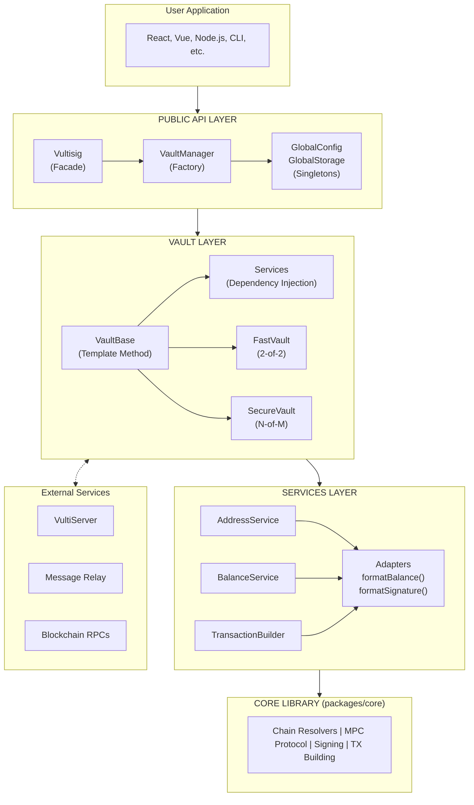

# Vultisig SDK Architecture

**Status:** Pre-Alpha

---

## Table of Contents

1. [Overview](#overview)
2. [Architecture Principles](#architecture-principles)
3. [Monorepo Structure](#monorepo-structure)
4. [SDK Package Structure](#sdk-package-structure)
5. [Core Components](#core-components)
6. [Vault System](#vault-system)
7. [Platform Support](#platform-support)
8. [Services](#services)
9. [Events System](#events-system)
10. [Type System](#type-system)
11. [Data Flow](#data-flow)
12. [Chain Support](#chain-support)

---

## Overview

The Vultisig SDK is a TypeScript library for creating and managing multi-chain cryptocurrency vaults using threshold signature schemes (TSS). It provides a unified interface for interacting with 34+ blockchain networks through multi-party computation (MPC), working seamlessly across browser and Node.js environments.

### What It Does

- **Vault Management** - Create, import, and manage cryptocurrency vaults
- **Multi-Chain Support** - Unified API for Bitcoin, Ethereum, Solana, and 30+ other chains
- **MPC Signing** - Secure transaction signing using threshold signatures
- **Balance Tracking** - Query native and token balances across all chains
- **Address Derivation** - Generate addresses for any supported chain
- **Gas Estimation** - Get current gas prices and fee estimates
- **Cross-Platform** - Works in browser and Node.js (Electron, React Native coming soon)

### Architecture Overview

The SDK follows a layered architecture:

1. **Public API Layer** - User-facing interfaces (`Vultisig`, `index.ts`)
2. **Vault Layer** - Vault hierarchy (`VaultBase`, `FastVault`, `SecureVault`)
3. **Services Layer** - Business logic services (signing, caching, balances)
4. **Platform Layer** - Platform-specific implementations (storage, WASM, crypto)

**Design Philosophy:** The SDK is a thin layer over the Vultisig Core library, using functional adapters to convert between Core's data formats and user-friendly SDK types. All blockchain logic lives in Core - the SDK focuses on providing excellent developer experience.

### Architecture Diagram



### Design Patterns Summary

| Pattern                | Component            | Purpose                                    |
| ---------------------- | -------------------- | ------------------------------------------ |
| **Facade**             | `Vultisig`           | Simple entry point hiding complexity       |
| **Factory**            | `VaultManager`       | Creates appropriate vault types            |
| **Template Method**    | `VaultBase`          | Common vault behavior with extension points|
| **Strategy**           | `FastVault`/`SecureVault` | Interchangeable signing strategies    |
| **Dependency Injection** | Vault services     | Testable, configurable services            |
| **Adapter**            | `formatBalance()` etc| Converts Core types to SDK types           |
| **Singleton**          | Global managers      | Shared state across SDK                    |
| **Observer**           | Event emitters       | Reactive state updates                     |

### Platform Bundles

The SDK supports multiple JavaScript environments through separate build-time bundles. Each bundle includes platform-specific implementations for storage, WASM loading, and crypto operations:

| Bundle                      | Platform         | Storage      | Use Case                |
| --------------------------- | ---------------- | ------------ | ----------------------- |
| `index.node.esm.js`         | Node.js          | Filesystem   | Server-side, CLI tools  |
| `index.browser.js`          | Browser          | IndexedDB    | Web applications        |

Users import the appropriate bundle for their platform - the SDK API remains identical across all bundles.

**Coming Soon:** Electron (main/renderer) and React Native platform bundles.

---

## Architecture Principles

### 1. Functional Adapter Pattern

The SDK uses functional adapters to convert between Core's data formats and user-friendly SDK types, with minimal abstraction layers.

```typescript
// Vault calls Core functions directly
class VaultBase {
  async balance(chain: string): Promise<Balance> {
    // 1. Call Core directly
    const rawBalance = await getCoinBalance({ chain, address });

    // 2. Format with adapter
    return formatBalance(rawBalance, chain);
  }
}
```

**Key characteristics:**

- Direct Core integration (no wrapper services)
- Adapters are pure formatting functions
- All blockchain logic delegated to Core
- SDK focuses on caching, events, and coordination

### 2. Platform Agnostic

The SDK works seamlessly across all JavaScript environments through platform-specific bundles:

- **Browser** - IndexedDB storage, browser crypto
- **Node.js** - Filesystem storage, native crypto

*Coming soon: Electron and React Native support.*

### 3. Type-Safe Events

All events are type-safe through generics, ensuring compile-time safety for event names and payloads:

```typescript
interface VaultEvents {
  balanceUpdated: { chain: string; balance: Balance };
  transactionSigned: { chain: string; txHash: string };
}

vault.on("balanceUpdated", ({ chain, balance }) => {
  // TypeScript knows the exact payload shape
});
```

### 4. Smart Caching Strategy

Intelligent caching based on data mutability:

- **Addresses:** Permanent cache (deterministic, never change)
- **Balances:** 5-minute TTL (change frequently)
- **Gas prices:** No cache (highly volatile)

---

## Monorepo Structure

```
vultisig-sdk/
├── packages/
│   ├── sdk/                    # Main SDK (@vultisig/sdk)
│   ├── core/                   # Upstream core library (read-only)
│   └── lib/                    # Upstream utilities (read-only)
├── clients/
│   └── cli/                    # CLI client
├── examples/
│   ├── browser/               # Browser example
│   ├── cli/                   # CLI examples
│   └── shell/                 # Shell/integration examples
├── .config/                   # Shared configuration
├── scripts/                   # Build and utility scripts
└── docs/                      # Documentation
```

### Package Relationships

- **`@vultisig/sdk`** - The main SDK package users install
- **`packages/core`** - Chain implementations, MPC protocol, signing logic (synced from upstream)
- **`packages/lib`** - WASM binaries, crypto utilities (synced from upstream)

---

## SDK Package Structure

```
packages/sdk/src/
├── index.ts                    # Public API exports
├── Vultisig.ts                 # Main SDK class
├── VaultManager.ts             # Vault lifecycle management
├── AddressBookManager.ts       # Address book functionality
├── constants.ts                # SDK constants
│
├── vault/                      # Vault implementation
│   ├── VaultBase.ts           # Abstract base vault class
│   ├── FastVault.ts           # 2-of-2 server-assisted vault
│   ├── SecureVault.ts         # Multi-device MPC vault
│   ├── VaultError.ts          # Error types
│   ├── VaultServices.ts       # Service injection interface
│   ├── services/              # Vault-specific services
│   │   ├── AddressService.ts      # Address derivation
│   │   ├── BalanceService.ts      # Balance fetching & caching
│   │   ├── GasEstimationService.ts # Gas/fee estimation
│   │   ├── TransactionBuilder.ts   # TX preparation
│   │   ├── BroadcastService.ts     # TX broadcasting
│   │   └── PreferencesService.ts   # User preferences
│   └── utils/
│       └── convertSignature.ts # Signature conversion
│
├── platforms/                  # Platform-specific implementations
│   ├── node/                  # Node.js platform
│   │   ├── index.ts
│   │   ├── storage.ts
│   │   ├── crypto.ts
│   │   ├── wasm.ts
│   │   └── polyfills.ts
│   ├── browser/               # Browser platform
│   ├── electron-main/         # Electron main process (coming soon)
│   ├── electron-renderer/     # Electron renderer (coming soon)
│   ├── react-native/          # React Native (coming soon)
│   └── types.ts               # Platform type definitions
│
├── server/                    # Server communication
│   ├── GlobalServerManager.ts # Server manager singleton
│   ├── ServerManager.ts       # Server coordination logic
│   └── index.ts
│
├── services/                  # SDK-wide services
│   ├── CacheService.ts        # TTL-based caching
│   ├── FastSigningService.ts  # Server-assisted signing
│   ├── FiatValueService.ts    # Fiat value lookups
│   ├── PasswordCacheService.ts # Password caching
│   ├── cache-types.ts
│   └── index.ts
│
├── storage/                   # Storage abstraction
│   ├── GlobalStorage.ts       # Storage singleton
│   ├── MemoryStorage.ts       # In-memory implementation
│   ├── types.ts               # Storage interfaces
│   └── index.ts
│
├── events/                    # Event system
│   ├── EventEmitter.ts        # UniversalEventEmitter class
│   ├── types.ts               # Event type definitions
│   └── index.ts
│
├── config/                    # Configuration
│   ├── GlobalConfig.ts        # Global config singleton
│   └── index.ts
│
├── adapters/                  # Data format conversion
│   ├── formatBalance.ts       # bigint → Balance
│   ├── formatGasInfo.ts       # FeeQuote → GasInfo
│   ├── formatSignature.ts     # KeysignSignature → Signature
│   ├── getChainSigningInfo.ts # Chain signing metadata
│   └── index.ts
│
├── wasm/                      # WebAssembly management
│   ├── WasmManager.ts         # WASM module loading
│   ├── types.ts
│   └── index.ts
│
├── crypto/                    # Cryptographic utilities
│   └── index.ts
│
├── utils/                     # General utilities
│   ├── validation.ts          # Input validation
│   ├── export.ts              # Vault export/import
│   └── memoizeAsync.ts        # Async memoization
│
└── types/                     # Type definitions
    └── index.ts               # SDK types and Core re-exports
```

---

## Core Components

### Vultisig Class

**File:** `src/Vultisig.ts`

The main SDK class that orchestrates all functionality using the facade pattern.

```typescript
import { Vultisig } from "@vultisig/sdk";

const sdk = new Vultisig();
await sdk.init();

// Create a fast vault
const vault = await sdk.createVault("My Vault", password);

// Get vault address
const address = await vault.address("Ethereum");
```

**Responsibilities:**

- SDK initialization and lifecycle management
- Vault creation and management delegation
- Storage integration and persistence
- Event emission for SDK-level state changes
- Address book operations

**Key Dependencies:**

- `VaultManager` - Vault operations
- `AddressBookManager` - Address book
- `GlobalServerManager` - Server communication
- `GlobalConfig` - Configuration
- `GlobalStorage` - Data persistence

### VaultManager Class

**File:** `src/VaultManager.ts`

Manages vault lifecycle and vault collection using the factory pattern.

```typescript
// Create fast vault (2-of-2 with server)
const vault = await vaultManager.createFastVault(name, password);

// Import existing vault
const vault = await vaultManager.importVault(vultFile, password);

// Export vault
const encrypted = await vaultManager.exportVault(vaultId, password);
```

**Responsibilities:**

- Vault creation (fast and secure vaults)
- Vault import from .vult files
- Vault export with encryption
- Active vault tracking
- Vault type detection

### Global Singletons

The SDK uses global singletons for cross-cutting concerns:

- **`GlobalServerManager`** - VultiServer and relay communication
- **`GlobalConfig`** - SDK configuration (chains, currency, callbacks)
- **`GlobalStorage`** - Platform-aware storage

---

## Vault System

### Vault Hierarchy

```
VaultBase (abstract)
├── FastVault    # 2-of-2 server-assisted signing
└── SecureVault  # Multi-device MPC signing
```

### VaultBase

**File:** `src/vault/VaultBase.ts`

Abstract base class providing common vault functionality.

```typescript
abstract class VaultBase extends UniversalEventEmitter<VaultEvents> {
  // Services
  protected addressService: AddressService;
  protected balanceService: BalanceService;
  protected gasEstimationService: GasEstimationService;
  protected transactionBuilder: TransactionBuilder;
  protected broadcastService: BroadcastService;
  protected preferencesService: PreferencesService;

  // Public API
  async address(chain: Chain): Promise<string>;
  async balance(chain: Chain, tokenId?: string): Promise<Balance>;
  async gas(chain: Chain): Promise<GasEstimate>;
  async prepareSendTx(params): Promise<KeysignPayload>;
  async extractMessageHashes(payload): Promise<string[]>;
  async broadcast(chain, payload, signature): Promise<string>;

  // Abstract methods
  abstract sign(payload: SigningPayload, password?: string): Promise<Signature>;
  abstract get availableSigningModes(): SigningMode[];
}
```

### FastVault

**File:** `src/vault/FastVault.ts`

Server-assisted 2-of-2 MPC vault for quick signing.

```typescript
class FastVault extends VaultBase {
  // Always encrypted, requires password
  // Uses VultiServer for server-side MPC participation
  // Only supports 'fast' signing mode

  async sign(payload: SigningPayload, password: string): Promise<Signature> {
    // Coordinates with server via FastSigningService
  }
}
```

**Characteristics:**

- Always encrypted (requires password for operations)
- 2-of-2 threshold (user device + server)
- Quick signing (~2-3 seconds)
- Requires network connectivity

### SecureVault

**File:** `src/vault/SecureVault.ts`

Multi-device MPC vault for maximum security.

```typescript
class SecureVault extends VaultBase {
  // Can be encrypted or unencrypted
  // Multiple devices participate in signing
  // Supports 'relay' and 'local' signing modes (planned)

  async sign(payload: SigningPayload, password?: string): Promise<Signature> {
    // Coordinates with other devices
  }
}
```

**Characteristics:**

- Configurable encryption
- N-of-M threshold (multiple devices)
- Higher security (no single point of compromise)
- Requires device coordination

### Vault Services

Each vault contains specialized services:

| Service                  | Purpose                              |
| ------------------------ | ------------------------------------ |
| `AddressService`         | Address derivation with caching      |
| `BalanceService`         | Balance fetching with TTL cache      |
| `GasEstimationService`   | Gas/fee estimation                   |
| `TransactionBuilder`     | Transaction preparation              |
| `BroadcastService`       | Transaction broadcasting             |
| `PreferencesService`     | User chain/token preferences         |

---

## Platform Support

### Platform Architecture

Each platform provides implementations for:

- **Storage** - Persistent data storage
- **Crypto** - Cryptographic operations
- **WASM** - WebAssembly module loading
- **Polyfills** - Missing APIs

### Platform Implementations

| Platform           | Storage      | Entry Point                        |
| ------------------ | ------------ | ---------------------------------- |
| Node.js            | Filesystem   | `dist/index.node.esm.js`           |
| Browser            | IndexedDB    | `dist/index.browser.js`            |

*Coming soon: Electron (main/renderer) and React Native bundles.*

### Build Configuration

The SDK builds platform-specific bundles using Rollup:

```javascript
// rollup.platforms.config.js
export default [
  { input: "src/platforms/node/index.ts", output: "dist/index.node.esm.js" },
  { input: "src/platforms/browser/index.ts", output: "dist/index.browser.js" },
  // ... other platforms
];
```

---

## Services

### CacheService

**File:** `src/services/CacheService.ts`

Scoped caching with TTL support.

```typescript
class CacheService {
  get<T>(scope: CacheScope, key: string): T | null;
  set<T>(scope: CacheScope, key: string, value: T, ttl?: number): void;
  invalidate(scope: CacheScope, key?: string): void;
}
```

**Cache Scopes:**

- `ADDRESS` - Permanent (addresses never change)
- `BALANCE` - 5 minutes
- `GAS` - No cache
- `PORTFOLIO` - 5 minutes
- `FIAT_VALUE` - 1 minute

### FastSigningService

**File:** `src/services/FastSigningService.ts`

Coordinates server-assisted MPC signing.

```typescript
class FastSigningService {
  async signWithServer(
    vault: FastVault,
    payload: SigningPayload,
    password: string,
  ): Promise<Signature>;
}
```

**Signing Flow:**

1. Validate vault has server signer
2. Extract message hashes from payload
3. Initiate server-side MPC participation
4. Coordinate MPC protocol via message relay
5. Combine signatures and return

### FiatValueService

**File:** `src/services/FiatValueService.ts`

Fetches fiat values for tokens/coins.

### PasswordCacheService

**File:** `src/services/PasswordCacheService.ts`

Caches vault passwords with configurable TTL.

---

## Events System

### UniversalEventEmitter

**File:** `src/events/EventEmitter.ts`

Zero-dependency, type-safe event emitter.

```typescript
class UniversalEventEmitter<T extends Record<string, any>> {
  on<K extends keyof T>(event: K, listener: (data: T[K]) => void): () => void;
  once<K extends keyof T>(event: K, listener: (data: T[K]) => void): () => void;
  off<K extends keyof T>(event: K, listener: (data: T[K]) => void): void;
  protected emit<K extends keyof T>(event: K, data: T[K]): void;
}
```

### Event Types

**SdkEvents:**

```typescript
interface SdkEvents {
  vaultChanged: { vaultId: string };
  error: { error: Error };
}
```

**VaultEvents:**

```typescript
interface VaultEvents {
  balanceUpdated: { chain: string; balance: Balance };
  transactionSigned: { chain: string; txHash: string };
  chainAdded: { chain: string };
  chainRemoved: { chain: string };
  tokenAdded: { chain: string; token: Token };
  tokenRemoved: { chain: string; tokenId: string };
  renamed: { oldName: string; newName: string };
  saved: void;
  deleted: void;
  loaded: void;
  error: { error: Error };
}
```

---

## Type System

### Public API Exports

From `src/index.ts`:

**Classes:**

- `Vultisig` - Main SDK class
- `VaultBase`, `FastVault`, `SecureVault` - Vault classes
- `VaultError`, `VaultImportError` - Error classes
- `GlobalServerManager`, `GlobalConfig` - Singletons
- `MemoryStorage` - Storage implementation
- `UniversalEventEmitter` - Event system
- `ValidationHelpers` - Validation utilities

**Type Guards:**

- `isFastVault(vault)` - Check if vault is FastVault
- `isSecureVault(vault)` - Check if vault is SecureVault

**Constants:**

- `SUPPORTED_CHAINS` - All supported blockchain chains
- `Chain` - Chain enum

**Types:**

```typescript
// Balance information
interface Balance {
  amount: string;
  decimals: number;
  symbol: string;
  chainId: string;
  tokenId?: string;
}

// Gas estimation
interface GasEstimate {
  chainId: string;
  gasPrice: string;
  maxFeePerGas?: string;
  priorityFee?: string;
}

// Signature result
interface Signature {
  signature: string;
  recovery?: number;
  format: "DER" | "ECDSA" | "EdDSA";
  signatures?: Array<{ r: string; s: string; der: string }>;
}

// Signing payload
interface SigningPayload {
  chain: string;
  transaction: any;
  derivePath?: string;
  messageHashes?: string[];
}
```

---

## Data Flow

### Address Derivation

```
vault.address('Ethereum')
  │
  ├── AddressService.getAddress()
  │     │
  │     ├── Check cache → [HIT] Return cached
  │     │
  │     ├── [MISS] Get WalletCore
  │     │
  │     ├── Core: getPublicKey({ chain, publicKeys, hexChainCode })
  │     │
  │     ├── Core: deriveAddress({ chain, publicKey, walletCore })
  │     │
  │     ├── Cache address (permanent)
  │     │
  │     └── Return address
```

### Balance Fetching

```
vault.balance('Ethereum')
  │
  ├── BalanceService.getBalance()
  │     │
  │     ├── Check cache (5-min TTL) → [HIT] Return cached
  │     │
  │     ├── [MISS] Get address
  │     │
  │     ├── Core: getCoinBalance({ chain, address })
  │     │
  │     ├── Adapter: formatBalance(rawBalance, chain)
  │     │
  │     ├── Cache balance
  │     │
  │     ├── Emit 'balanceUpdated' event
  │     │
  │     └── Return Balance
```

### Fast Signing Flow

```
// Step 1: Prepare transaction
vault.prepareSendTx({ coin, receiver, amount })
  │
  └── TransactionBuilder.prepareSendTx()
        │
        └── Core: buildSendKeysignPayload(...)
              │
              └── Return KeysignPayload

// Step 2: Extract message hashes
vault.extractMessageHashes(keysignPayload)
  │
  └── TransactionBuilder.extractMessageHashes()
        │
        └── Core: getPreSigningHashes(...)
              │
              └── Return string[]

// Step 3: Sign
vault.sign(payload, password)
  │
  └── FastSigningService.signWithServer()
        │
        ├── POST /vault/sign (VultiServer)
        │
        ├── WebSocket MPC coordination (Relay)
        │
        ├── Core: keysign() (MPC protocol)
        │
        └── Return Signature

// Step 4: Broadcast
vault.broadcast(chain, payload, signature)
  │
  └── BroadcastService.broadcast()
        │
        ├── Core: compileTx({ signature, payload })
        │
        ├── Core: broadcastTx({ chain, tx })
        │
        └── Return txHash
```

---

## Chain Support

### Supported Chains (34+)

All chains supported through Core's functional resolvers. The SDK has no chain-specific code.

| Category   | Chains                                                                                  |
| ---------- | --------------------------------------------------------------------------------------- |
| **EVM**    | Ethereum, Polygon, Arbitrum, Optimism, BSC, Avalanche, Base, Blast, Zksync, Cronos, Mantle, Sei, Hyperliquid |
| **UTXO**   | Bitcoin, Litecoin, Dogecoin, Bitcoin Cash, Dash, Zcash                                  |
| **Cosmos** | Cosmos, THORChain, MayaChain, Osmosis, Dydx, Kujira, Terra, TerraClassic, Noble, Akash  |
| **Other**  | Solana, Sui, Polkadot, Ton, Ripple, Tron, Cardano                                       |

### Chain Architecture

Chains are organized by "kind" in the Core library:

```typescript
type ChainKind =
  | "evm"
  | "utxo"
  | "cosmos"
  | "solana"
  | "sui"
  | "polkadot"
  | "ton"
  | "ripple"
  | "tron"
  | "cardano";
```

Each chain kind has specific:

- **Signature algorithm** - ECDSA or EdDSA
- **Signature format** - DER, raw, rawWithRecoveryId
- **RPC endpoints** - Chain-specific API URLs
- **Transaction format** - Chain-specific encoding

### Token Support

| Chain Type | Token Standard | Example         |
| ---------- | -------------- | --------------- |
| EVM        | ERC-20         | USDC, USDT, DAI |
| Solana     | SPL            | USDC (SPL)      |
| Cosmos     | IBC, CW20      | Various         |

---

## Summary

The Vultisig SDK architecture is **clean, layered, and platform-agnostic**:

- **Entry Point:** `Vultisig` class provides facade over all functionality
- **Vault System:** `VaultBase` → `FastVault`/`SecureVault` hierarchy
- **Services:** Specialized services for each vault operation
- **Platforms:** Platform-specific bundles for each environment
- **Core Integration:** Direct delegation to Core for blockchain logic

**Key Strengths:**

- Works seamlessly across browser and Node.js (Electron, React Native coming soon)
- Type-safe throughout with TypeScript generics
- Smart caching based on data mutability
- Direct Core integration for blockchain operations
- Event-driven architecture for reactive UIs

**Design Patterns Used:**

1. **Facade Pattern** - Vultisig and VaultBase provide simple interfaces
2. **Factory Pattern** - VaultManager creates appropriate vault types
3. **Strategy Pattern** - Platform-specific implementations
4. **Observer Pattern** - Type-safe event emission
5. **Dependency Injection** - Services injected into vaults
6. **Adapter Pattern** - Format conversion between Core and SDK types
