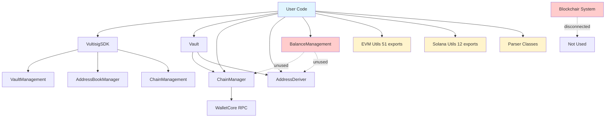
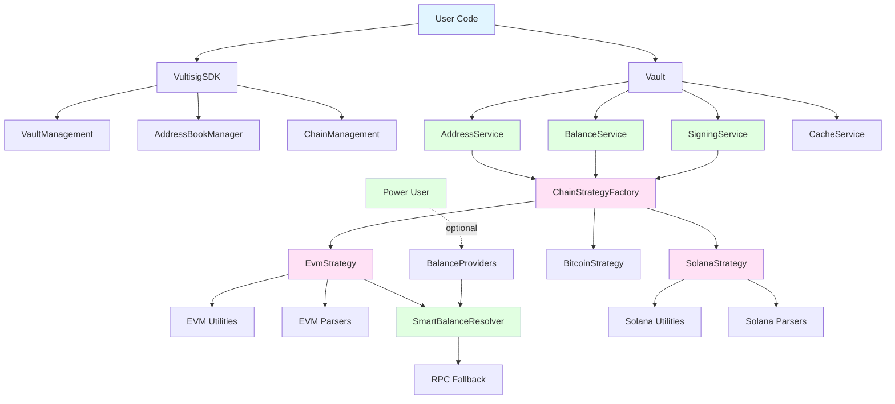
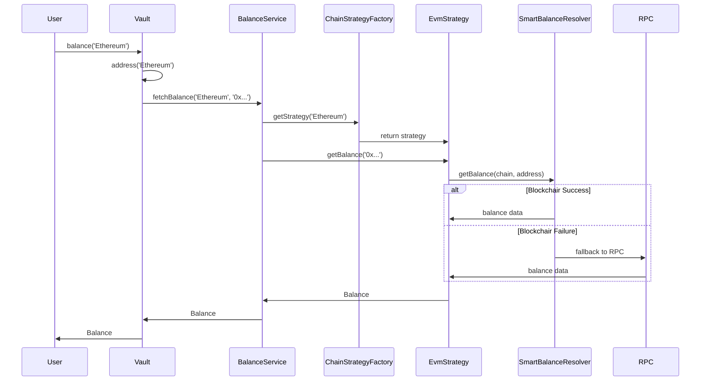

# Architecture Refactoring Proposal

**Date:** 2025-10-28
**Status:** Proposal
**Version:** 1.0
**Author:** Architecture Review Team

---

## Executive Summary

This proposal outlines a comprehensive refactoring of the Vultisig SDK's internal architecture while maintaining **100% backward compatibility** with the existing public API. The refactoring addresses critical issues with over-exposure of internal implementation details, redundant components, and architectural inconsistencies.

### Key Objectives

1. **Preserve Public API** - Zero breaking changes to VultisigSDK and Vault classes
2. **Encapsulate Implementation** - Hide chain-specific details behind service layer
3. **Reduce Exports** - Decrease public index.ts exports from 120+ to ~10-15 items (92% reduction)
4. **Improve Architecture** - Implement Strategy pattern for chain operations
5. **Delete Redundancy** - Remove unused components (BalanceManagement)
6. **Enhance Features** - Integrate existing Blockchair system

### Success Metrics

- ✅ **Zero breaking changes** to public API
- ✅ **92% reduction** in exported items (120+ → 10-15)
- ✅ **100% test pass** rate maintained
- ✅ **Clear architecture** with documented boundaries
- ✅ **Easy extensibility** for new chains

---

## Table of Contents

1. [Problem Statement](#problem-statement)
2. [Proposed Solution](#proposed-solution)
3. [Benefits Analysis](#benefits-analysis)
4. [Architecture Overview](#architecture-overview)
5. [Migration Strategy](#migration-strategy)
6. [Risk Assessment](#risk-assessment)
7. [Success Criteria](#success-criteria)

---

## Problem Statement

### Current Issues

#### 1. Over-Exposure of Internal API (Critical Priority)

**Problem:** 100+ internal utilities exposed as public API

```typescript
// Current: Users can import everything
import {
  parseEvmTransaction,           // Internal parser
  estimateTransactionGas,         // Internal utility
  getTokenBalance,                // Internal utility
  formatGasPrice,                 // Internal formatter
  EVM_CHAIN_IDS,                  // Internal constant
  Erc20Parser,                    // Internal class
  ChainManager,                   // Internal manager
  AddressDeriver                  // Internal manager
} from 'vultisig-sdk'
```

**Impact:**
- 😕 **User Confusion:** 120+ exports overwhelm developers
- 🔒 **Lock-In:** Can't refactor internals without breaking changes
- 📚 **Documentation Burden:** Must document all 120+ items
- 🧪 **Testing Overhead:** All exports become public API contract
- 📦 **Bundle Bloat:** Users import unnecessary implementation details

**Severity:** 🔴 **CRITICAL** - Fundamental architectural issue

---

#### 2. Fragmented Developer Experience

**Problem:** Users must learn both high-level and low-level APIs

```typescript
// High-level API (good)
const balance = await vault.balance('Ethereum')

// vs

// Low-level API (exposed but shouldn't be)
import { parseEvmTransaction, buildEvmKeysignPayload } from 'vultisig-sdk'
const parsed = await parseEvmTransaction(core, rawTx)
const payload = await buildEvmKeysignPayload({ ... })
```

**Impact:**
- 📚 **Steep Learning Curve:** Which API to use?
- 🐛 **Error-Prone:** Easy to misuse low-level APIs
- 📖 **Documentation Split:** Two sets of docs to maintain

**Severity:** 🟡 **MEDIUM** - Usability issue

---

#### 3. Unused and Redundant Components

**Problem:** BalanceManagement.ts is 100% redundant and unused

```typescript
// BalanceManagement: Pure pass-through wrapper
class BalanceManagement {
  getBalances(addresses) {
    return this.chainManager.getBalances(addresses)  // Just delegates
  }
  deriveAddress(vault, chain) {
    return this.addressDeriver.deriveAddress(vault, chain)  // Just delegates
  }
  // All 7 methods are simple delegation
}

// Reality: Not used anywhere
// ❌ Not imported by VultisigSDK.ts
// ❌ Not imported by Vault.ts
// ❌ Not instantiated anywhere
// ✅ Exported publicly (why?)
```

**Impact:**
- 🧹 **Code Debt:** Maintenance burden
- 😕 **Confusion:** Users see it but shouldn't use it
- 📦 **Bundle Size:** Included for no reason

**Severity:** 🟡 **MEDIUM** - Should be removed

---

#### 4. Disconnected Blockchair Integration

**Problem:** Sophisticated balance system exists but isn't integrated

**Current State:**
- ✅ Full Blockchair API client implemented
- ✅ Smart resolver with fallback (Blockchair → RPC)
- ✅ Supports EVM (11 chains), Solana, Cardano
- ✅ Well-tested, production-ready
- ❌ **NOT used by Vault or ChainManager**

**Impact:**
- 🚀 **Performance:** Missing faster Blockchair responses
- 💪 **Resilience:** Missing automatic RPC fallback
- 📊 **Features:** Missing rich balance data

**Severity:** 🟡 **MEDIUM** - Lost opportunity

---

#### 5. Architectural Inconsistencies

**Problem:** No clear pattern for chain operations

**Current Mix:**
- ChainManager exists but not used consistently
- Some chain code in Vault directly
- Utilities scattered across modules
- No common interface for chains

**Impact:**
- 🔀 **Inconsistency:** Hard to add new chains
- 🐛 **Bugs:** Easy to miss edge cases
- 📖 **Documentation:** Unclear patterns

**Severity:** 🟡 **MEDIUM** - Technical debt

---

## Proposed Solution

### High-Level Strategy

**Keep the excellent public API, refactor the internal implementation.**

```
┌─────────────────────────────────────┐
│    PUBLIC API (Unchanged)          │
│  - VultisigSDK (29 methods)         │
│  - Vault (24 methods)                │
│  - 10-15 essential exports           │
└──────────────┬──────────────────────┘
               │ REFACTOR EVERYTHING BELOW
┌──────────────▼──────────────────────┐
│   INTERNAL SERVICE LAYER (New)     │
│  - AddressService                    │
│  - BalanceService                    │
│  - SigningService                    │
└──────────────┬──────────────────────┘
               │
┌──────────────▼──────────────────────┐
│  STRATEGY PATTERN (New)            │
│  - ChainStrategy interface           │
│  - EvmStrategy, SolanaStrategy       │
│  - ChainStrategyFactory              │
└──────────────┬──────────────────────┘
               │
┌──────────────▼──────────────────────┐
│  CHAIN IMPLEMENTATIONS (Exists)    │
│  - chains/evm/* (utilities)          │
│  - chains/solana/* (utilities)       │
│  - Blockchair integration            │
└─────────────────────────────────────┘
```

---

### Solution Components

#### 1. Internal Service Layer

**Create:** `vault/services/` directory with chain-agnostic services

**Services:**
- **AddressService:** Coordinates address derivation across chains
- **BalanceService:** Coordinates balance fetching with Blockchair integration
- **SigningService:** Coordinates transaction signing across chains
- **CacheService:** Centralizes caching logic (extracted from Vault)

**Key Principle:** Services use strategies internally, not exposed publicly

```typescript
// Internal service (not exported)
class BalanceService {
  constructor(
    private strategyFactory: ChainStrategyFactory,
    private blockchairResolver: SmartBalanceResolver
  ) {}

  async fetchBalance(chain: string, address: string): Promise<Balance> {
    const strategy = this.strategyFactory.getStrategy(chain)
    return strategy.getBalance(address, this.blockchairResolver)
  }
}

// Vault uses service internally (public method unchanged)
class Vault {
  private balanceService: BalanceService

  async balance(chain: string): Promise<Balance> {
    const address = await this.address(chain)
    return this.balanceService.fetchBalance(chain, address)
  }
}
```

---

#### 2. Strategy Pattern for Chain Operations

**Create:** `chains/strategies/` directory with common interface

**Interface:**
```typescript
interface ChainStrategy {
  // Address derivation
  deriveAddress(vault: CoreVault): Promise<string>

  // Balance operations
  getBalance(address: string, resolver?: BalanceResolver): Promise<Balance>

  // Transaction operations
  parseTransaction(rawTx: any): Promise<ParsedTransaction>
  buildKeysignPayload(tx: ParsedTransaction): Promise<KeysignPayload>

  // Gas estimation (if applicable)
  estimateGas?(tx: any): Promise<GasEstimate>
}
```

**Implementations:**
- **EvmStrategy:** Wraps all EVM utilities
- **SolanaStrategy:** Wraps all Solana utilities
- **BitcoinStrategy:** Future implementation
- **CosmosStrategy:** Future implementation

**Factory:**
```typescript
class ChainStrategyFactory {
  private strategies = new Map<string, ChainStrategy>()

  constructor() {
    // Register strategies
    this.registerEvmChains()
    this.register('Solana', new SolanaStrategy())
  }

  getStrategy(chain: string): ChainStrategy {
    const strategy = this.strategies.get(chain)
    if (!strategy) throw new Error(`Unsupported chain: ${chain}`)
    return strategy
  }

  private registerEvmChains() {
    const evmChains = ['Ethereum', 'Arbitrum', 'Base', 'Polygon', ...]
    for (const chain of evmChains) {
      this.register(chain, new EvmStrategy(chain))
    }
  }
}
```

---

#### 3. Enhance ChainManager with Blockchair

**Integrate:** SmartBalanceResolver into ChainManager

```typescript
class ChainManager {
  private balanceResolver: SmartBalanceResolver

  constructor(
    private wasmManager: WASMManager,
    config?: { preferBlockchair?: boolean }
  ) {
    this.balanceResolver = createSmartBalanceResolver({
      preferBlockchair: config?.preferBlockchair ?? true,
      fallbackToRpc: true
    })
  }

  private async getChainBalance(chain: Chain, address: string): Promise<Balance> {
    // Use Blockchair with RPC fallback
    return this.balanceResolver.getBalance(chain, address)
  }
}
```

**Benefits:**
- Automatic Blockchair → RPC fallback
- Better performance
- Richer balance data
- No API changes

---

#### 4. Clean Up Public Exports

**Before (120+ exports):**
```typescript
// index.ts
export { Vultisig } from './VultisigSDK'
export { Vault } from './vault'
export { ChainManager, AddressDeriver } from './chains'  // ❌ Internal
export { BalanceManagement } from './vault'  // ❌ Unused
export { parseEvmTransaction } from './chains/evm'  // ❌ Internal
export { estimateTransactionGas } from './chains/evm'  // ❌ Internal
export { getTokenBalance } from './chains/evm'  // ❌ Internal
export { Erc20Parser, UniswapParser } from './chains/evm'  // ❌ Internal
export { EVM_CHAIN_IDS, COMMON_TOKENS } from './chains/evm'  // ❌ Internal
// ... 100+ more internal exports
```

**After (10-15 exports):**
```typescript
// index.ts

// Core SDK
export { Vultisig } from './VultisigSDK'
export { Vault, VaultError, VaultErrorCode } from './vault'

// Essential types for TypeScript users
export type {
  Balance,
  Signature,
  SigningPayload,
  SigningMode,
  AddressBookEntry,
  VaultSummary,
  ServerStatus
} from './types'

// Chain-specific types (if users need them)
export type {
  ParsedEvmTransaction,
  EvmToken,
  EvmGasEstimate
} from './chains/evm/types'

export type {
  ParsedSolanaTransaction
} from './chains/solana/types'

// Advanced features for power users
export { BalanceProviders } from './vault/balance'

// That's it! Everything else is internal
```

---

#### 5. Delete Redundant Components

**Remove:**
- ❌ `vault/BalanceManagement.ts` - Unused, 100% redundant
- ❌ Export of `ChainManager` from index.ts - Internal service
- ❌ Export of `AddressDeriver` from index.ts - Internal service
- ❌ Exports of internal managers from index.ts

**Keep (but don't export):**
- ✅ ChainManager - Used internally, enhanced with Blockchair
- ✅ AddressDeriver - Used internally
- ✅ VaultManagement, AddressBookManager, ChainManagement - Internal managers

---

#### 6. Refactor ServerManager to Pure Server Coordination

**Current Problem:** ServerManager contains chain-specific logic that violates the strategy pattern

**Extract Chain Logic to Strategies:**

Add new methods to `ChainStrategy` interface for fast vault support:

```typescript
interface ChainStrategy {
  // Existing methods...
  deriveAddress(vault: CoreVault): Promise<string>
  getBalance(address: string, resolver?: BalanceResolver): Promise<Balance>
  parseTransaction(rawTx: any): Promise<ParsedTransaction>
  buildKeysignPayload(tx: ParsedTransaction): Promise<KeysignPayload>
  estimateGas?(tx: any): Promise<GasEstimate>

  // NEW: Fast vault signing support
  computePreSigningHashes(
    payload: SigningPayload,
    vault: Vault,
    walletCore: any
  ): Promise<string[]>

  formatSignatureResult(
    signatureResults: Record<string, any>,
    payload: SigningPayload
  ): Promise<Signature>
}
```

**Create FastSigningService:**

New service to coordinate fast vault signing by combining ServerManager (server communication) and ChainStrategy (chain logic):

```typescript
// NEW: vault/services/FastSigningService.ts
class FastSigningService {
  constructor(
    private serverManager: ServerManager,
    private strategyFactory: ChainStrategyFactory
  ) {}

  async signWithServer(
    vault: Vault,
    payload: SigningPayload,
    password: string
  ): Promise<Signature> {
    // Validate vault has server signer
    this.validateFastVault(vault)

    // Get chain strategy
    const strategy = this.strategyFactory.getStrategy(payload.chain)

    // Initialize WalletCore
    const walletCore = await initWasm()

    // Strategy computes hashes (chain-specific)
    const messages = payload.messageHashes ||
      await strategy.computePreSigningHashes(payload, vault, walletCore)

    // ServerManager coordinates signing (server communication)
    return this.serverManager.coordinateFastSigning({
      vault,
      messages,
      password,
      strategy
    })
  }

  private validateFastVault(vault: Vault): void {
    const hasFastVaultServer = vault.signers.some(s => s.startsWith('Server-'))
    if (!hasFastVaultServer) {
      throw new Error('Vault does not have VultiServer - fast signing not available')
    }
  }
}
```

**Refactor ServerManager:**

Transform from mixed concerns to pure server coordination:

```typescript
// REFACTORED: Pure server coordination, no chain logic
class ServerManager {
  async coordinateFastSigning(options: {
    vault: Vault
    messages: string[]       // Pre-computed by strategy
    password: string
    strategy: ChainStrategy  // For result formatting
  }): Promise<Signature> {
    const { vault, messages, password, strategy } = options

    // Generate session parameters
    const sessionId = generateSessionId()
    const hexEncryptionKey = await generateEncryptionKey()

    // Step 1: Call FastVault API
    await this.callFastVaultAPI({ sessionId, messages, vault, password })

    // Step 2: Join relay session
    await this.joinRelaySession(sessionId, vault.localPartyId)

    // Step 3: Wait for peers
    const devices = await this.waitForPeers(sessionId, vault.localPartyId)

    // Step 4: Start MPC session
    await this.startMpcSession(sessionId, devices)

    // Step 5: Perform MPC keysign
    const signatureResults = await this.performMpcKeysign({
      vault,
      messages,
      devices,
      sessionId,
      hexEncryptionKey
    })

    // Step 6: Format result using strategy (chain-specific)
    return strategy.formatSignatureResult(signatureResults, payload)
  }

  // ❌ REMOVE: computeMessageHashesFromTransaction (moved to strategies)
}
```

**Update Vault Integration:**

```typescript
class Vault {
  private fastSigningService: FastSigningService  // NEW

  constructor(
    vaultData: CoreVault,
    walletCore: WalletCore,
    serverManager: ServerManager,
    addressService: AddressService,
    balanceService: BalanceService,
    signingService: SigningService
  ) {
    // ... existing initialization ...

    // Initialize fast signing service
    this.fastSigningService = new FastSigningService(
      serverManager,
      new ChainStrategyFactory()
    )
  }

  async sign(
    mode: 'fast' | 'relay' | 'local',
    payload: SigningPayload,
    options?: { vaultPassword?: string }
  ): Promise<Signature> {
    // Fast mode: use FastSigningService
    if (mode === 'fast') {
      if (!options?.vaultPassword) {
        throw new VaultError('Vault password required for fast signing')
      }

      return this.fastSigningService.signWithServer(
        this.vaultData,
        payload,
        options.vaultPassword
      )
    }

    // Regular signing modes: use SigningService
    return this.signingService.sign(payload, mode)
  }
}
```

**Remove ServerManager from Public Exports:**

```typescript
// index.ts - CHANGE LINE 112
// Before: export * from './server'  ❌
// After:   export type { ServerStatus, KeygenProgressUpdate } from './server'  ✅

// ServerManager becomes internal only
// Users access via: vault.sign('fast', payload)
```

**Benefits:**
- ✅ ServerManager = pure server coordination (no chain logic)
- ✅ ChainStrategy = all chain-specific logic (compute hashes, format results)
- ✅ FastSigningService = orchestration layer
- ✅ Easy to test separately (mock strategy, test server coordination)
- ✅ Easy to add new chains (implement strategy methods)
- ✅ ServerManager becomes internal (not exported)

---

## Benefits Analysis

### 1. Developer Experience Benefits

#### Simplified API Surface

**Before:**
```typescript
import {
  Vultisig,
  parseEvmTransaction,
  buildEvmKeysignPayload,
  estimateTransactionGas,
  getTokenBalance,
  formatGasPrice,
  weiToGwei
} from 'vultisig-sdk'

// Too many imports, overwhelming choice
```

**After:**
```typescript
import { Vultisig } from 'vultisig-sdk'

const sdk = new Vultisig()
const vault = await sdk.getVault('my-vault', 'password')
const balance = await vault.balance('Ethereum')

// Clean, simple, discoverable
```

**Benefits:**
- ✅ 92% fewer exports (120+ → 10-15)
- ✅ One import for most use cases
- ✅ IDE autocomplete shows only relevant methods
- ✅ Shorter learning curve

---

#### Better Discoverability

**Before:**
```typescript
// Users must know specific function names
import { estimateTransactionGas } from 'vultisig-sdk'

// Where is this function? What does it do? What parameters?
const gas = await estimateTransactionGas(chain, tx)
```

**After:**
```typescript
// Users discover methods via object
const vault = await sdk.getVault('my-vault', 'password')
vault.  // ← IDE shows: address(), balance(), sign(), estimateGas()

// Clear hierarchy, obvious usage
const gas = await vault.estimateGas(tx, 'Ethereum')
```

**Benefits:**
- ✅ IDE autocomplete guides users
- ✅ Methods organized by domain (vault operations)
- ✅ Self-documenting API structure

---

#### Fewer Breaking Changes for Users

**Before:**
```typescript
// If we refactor parseEvmTransaction, users break
import { parseEvmTransaction } from 'vultisig-sdk'
const parsed = await parseEvmTransaction(core, rawTx)
```

**After:**
```typescript
// Internal refactoring doesn't affect users
const balance = await vault.balance('Ethereum')

// We can change how balance() works internally without breaking users
```

**Benefits:**
- ✅ Internal refactoring safe
- ✅ Fewer version bumps needed
- ✅ Easier to maintain backward compatibility

---

### 2. Architectural Benefits

#### Clear Separation of Concerns

**Service Layer:**
```
vault.balance('Ethereum')
  ↓
BalanceService.fetchBalance()
  ↓
ChainStrategyFactory.getStrategy('Ethereum')
  ↓
EvmStrategy.getBalance()
  ↓
SmartBalanceResolver (Blockchair → RPC)
  ↓
Actual balance data
```

**Benefits:**
- ✅ Each layer has single responsibility
- ✅ Easy to test (mock layers)
- ✅ Easy to extend (add strategies)
- ✅ Easy to understand (clear flow)

---

#### Strategy Pattern for Extensibility

**Adding a New Chain:**

```typescript
// 1. Create strategy
class PolkadotStrategy implements ChainStrategy {
  async deriveAddress(vault: CoreVault): Promise<string> {
    // Polkadot-specific logic
  }

  async getBalance(address: string): Promise<Balance> {
    // Polkadot-specific logic
  }

  async parseTransaction(rawTx: any): Promise<ParsedTransaction> {
    // Polkadot-specific logic
  }

  async buildKeysignPayload(tx: ParsedTransaction): Promise<KeysignPayload> {
    // Polkadot-specific logic
  }
}

// 2. Register in factory
factory.register('Polkadot', new PolkadotStrategy())

// 3. Done! Works with existing Vault API
const polkadotBalance = await vault.balance('Polkadot')
```

**Benefits:**
- ✅ Easy to add chains (just implement interface)
- ✅ No changes to Vault or VultisigSDK
- ✅ Chain-specific logic encapsulated
- ✅ Consistent patterns across chains

---

#### Improved Testability

**Before (hard to test):**
```typescript
// Vault directly imports chain utilities
import { parseEvmTransaction } from '../chains/evm'

class Vault {
  async sign(payload) {
    const parsed = await parseEvmTransaction(this.core, payload.transaction)
    // Can't mock parseEvmTransaction easily
  }
}
```

**After (easy to test):**
```typescript
// Vault uses injected service
class Vault {
  constructor(
    vaultData: CoreVault,
    walletCore: WalletCore,
    signingService: SigningService  // ← Mockable
  ) {
    this.signingService = signingService
  }

  async sign(payload) {
    return this.signingService.sign(payload)
  }
}

// Test with mock
const mockSigningService = { sign: jest.fn() }
const vault = new Vault(data, core, mockSigningService)
```

**Benefits:**
- ✅ Easy to mock services
- ✅ Fast unit tests (no real chain calls)
- ✅ Test edge cases easily
- ✅ Better code coverage

---

#### ServerManager Refactoring Example

**Before (Mixed Concerns - 240 lines):**
```typescript
// ServerManager.signWithServer() contains everything
class ServerManager {
  async signWithServer(vault, payload, password): Promise<Signature> {
    // 1. Chain-specific logic (85 lines)
    const messages = await this.computeMessageHashesFromTransaction(payload, walletCore, chain, vault)
    if (network === 'ethereum') { /* EVM logic */ }
    if (network === 'bitcoin') { /* Bitcoin logic */ }
    if (network === 'solana') { /* Solana logic */ }

    // 2. Server coordination (100 lines)
    const sessionId = generateSessionId()
    await callFastVaultAPI(...)
    await joinRelaySession(...)
    const devices = await waitForPeers(...)

    // 3. MPC signing (30 lines)
    const signatureResults = await keysign(...)

    // 4. Chain-specific result formatting (25 lines)
    if (isUtxo) { /* compile transaction */ }
    else { /* format EVM signature */ }
  }
}

// Problems:
// - Can't test server coordination without chain implementations
// - Can't add new chains without modifying ServerManager
// - Mixed responsibilities make code hard to understand
```

**After (Separation of Concerns):**
```typescript
// 1. Chain logic in strategies (20-50 lines each)
class EvmStrategy implements ChainStrategy {
  async computePreSigningHashes(payload, vault, walletCore): Promise<string[]> {
    // 18 lines of EVM-specific logic
    const { serializeTransaction, keccak256 } = await import('viem')
    const serialized = serializeTransaction(unsigned)
    return [keccak256(serialized).slice(2)]
  }

  async formatSignatureResult(signatureResults, payload): Promise<Signature> {
    // EVM-specific result formatting
    const sigResult = signatureResults[messages[0]]
    return { signature: sigResult.der_signature, format: 'ECDSA', recovery: recoveryId }
  }
}

class BitcoinStrategy implements ChainStrategy {
  async computePreSigningHashes(payload, vault, walletCore): Promise<string[]> {
    // 50 lines of UTXO/PSBT logic
    const inputs = getTxInputData({ keysignPayload, walletCore, publicKey })
    return inputs.flatMap(txInputData => getPreSigningHashes({ walletCore, chain, txInputData }))
  }

  async formatSignatureResult(signatureResults, payload): Promise<Signature> {
    // Compile UTXO transaction
    const compiledTxs = inputs.map(txInputData => compileTx({ publicKey, txInputData, signatures, chain, walletCore }))
    return { signature: compiledTxHex, format: 'DER' }
  }
}

// 2. Orchestration in FastSigningService (40 lines)
class FastSigningService {
  async signWithServer(vault, payload, password): Promise<Signature> {
    const strategy = this.strategyFactory.getStrategy(payload.chain)
    const messages = await strategy.computePreSigningHashes(payload, vault, walletCore)
    return this.serverManager.coordinateFastSigning({ vault, messages, password, strategy })
  }
}

// 3. Pure server coordination in ServerManager (100 lines)
class ServerManager {
  async coordinateFastSigning({ vault, messages, password, strategy }): Promise<Signature> {
    const sessionId = generateSessionId()
    await this.callFastVaultAPI({ sessionId, messages, vault, password })
    await this.joinRelaySession(sessionId, vault.localPartyId)
    const devices = await this.waitForPeers(sessionId, vault.localPartyId)
    const signatureResults = await this.performMpcKeysign({ vault, messages, devices, sessionId })
    return strategy.formatSignatureResult(signatureResults, payload)
  }
}
```

**Testing Improvements:**
```typescript
// Before: Can't test server coordination without chain implementations
await serverManager.signWithServer(vault, payload, password) // Tests everything at once

// After: Test components independently

// Test 1: Test EVM strategy (no server involved)
const evmStrategy = new EvmStrategy()
const hashes = await evmStrategy.computePreSigningHashes(payload, vault, walletCore)
expect(hashes).toHaveLength(1)
expect(hashes[0]).toMatch(/^[0-9a-f]{64}$/)

// Test 2: Test server coordination (mock strategy)
const mockStrategy = {
  computePreSigningHashes: jest.fn().mockResolvedValue(['hash1', 'hash2']),
  formatSignatureResult: jest.fn().mockResolvedValue({ signature: '0x...' })
}
await serverManager.coordinateFastSigning({
  vault,
  messages: ['hash1', 'hash2'],
  password,
  strategy: mockStrategy
})
expect(mockStrategy.formatSignatureResult).toHaveBeenCalled()

// Test 3: Test FastSigningService orchestration (mock both)
const mockServerManager = { coordinateFastSigning: jest.fn() }
const mockStrategyFactory = { getStrategy: jest.fn().mockReturnValue(mockStrategy) }
const fastSigningService = new FastSigningService(mockServerManager, mockStrategyFactory)
await fastSigningService.signWithServer(vault, payload, password)
expect(mockStrategyFactory.getStrategy).toHaveBeenCalledWith(payload.chain)
expect(mockServerManager.coordinateFastSigning).toHaveBeenCalled()
```

**Benefits:**
- ✅ **Single Responsibility:** ServerManager = server coordination only
- ✅ **Testable:** Can test each component independently
- ✅ **Extensible:** Add new chains by implementing strategy methods
- ✅ **Maintainable:** Clear boundaries between server logic and chain logic
- ✅ **Reusable:** Strategies can be used for both fast and regular signing

---

### 3. Maintenance Benefits

#### Reduced Public API Surface

**Metric:** 92% reduction in public exports (120+ → 10-15)

**Impact:**
- 🔒 **Breaking Changes:** Easier to avoid (only 10-15 items to protect)
- 📚 **Documentation:** 92% less to document publicly
- 🧪 **Testing:** 92% less public API to test
- 🐛 **Bug Surface:** Smaller API = fewer bugs

**Example:**
```typescript
// Before: 51 EVM exports must all be backward compatible
// After: Only Vault methods must be backward compatible
```

---

#### Easier Refactoring

**Before:**
```typescript
// Can't refactor parseEvmTransaction without breaking users
export { parseEvmTransaction } from './chains/evm'
```

**After:**
```typescript
// Can refactor EvmStrategy.parseTransaction freely
class EvmStrategy {
  async parseTransaction(rawTx: string) {
    // Internal implementation, can change anytime
  }
}
```

**Benefits:**
- ✅ Refactor internals without user impact
- ✅ Optimize performance freely
- ✅ Fix bugs without API changes
- ✅ Modernize code over time

---

#### Better Code Organization

**Before:**
```
/chains/evm/
  - 25+ files
  - All exported individually
  - No clear hierarchy
```

**After:**
```
/chains/evm/
  - EvmStrategy.ts (single entry point)
  - utilities/ (internal, not exported)
  - parsers/ (internal, not exported)
  - gas/ (internal, not exported)
  - tokens/ (internal, not exported)
```

**Benefits:**
- ✅ Clear entry point (EvmStrategy)
- ✅ Utilities organized by purpose
- ✅ Easy to navigate codebase
- ✅ Clear public vs internal boundaries

---

### 4. Performance Benefits

#### Blockchair Integration

**Before (RPC only):**
```
vault.balance('Ethereum')
  ↓
ChainManager.getBalance()
  ↓
getCoinBalance() from core (RPC)
  ↓
~1-3 seconds response time
```

**After (Blockchair with RPC fallback):**
```
vault.balance('Ethereum')
  ↓
BalanceService.fetchBalance()
  ↓
SmartBalanceResolver (Blockchair)
  ↓
~200-500ms response time

If Blockchair fails:
  ↓ automatic fallback
getCoinBalance() from core (RPC)
  ↓
~1-3 seconds response time
```

**Benefits:**
- ✅ **5-10x faster** balance fetching (Blockchair)
- ✅ **Automatic fallback** to RPC if Blockchair down
- ✅ **Richer data** (tokens, transactions, metadata)
- ✅ **No API changes** required

---

#### Better Caching Strategy

**Current:** Caching logic spread across Vault

**Proposed:** Centralized CacheService

```typescript
class CacheService {
  private addressCache: Map<string, string>
  private balanceCache: Map<string, CachedBalance>

  // Centralized cache logic
  getCached<T>(key: string, ttl: number): T | null
  setCached<T>(key: string, value: T): void
  clearExpired(): void
}
```

**Benefits:**
- ✅ Consistent caching across services
- ✅ Easy to tune cache settings
- ✅ Better cache hit rates
- ✅ Lower memory usage

---

### 5. Security Benefits

#### Reduced Attack Surface

**Principle:** Fewer exports = smaller attack surface

**Before:**
```typescript
// Users can import internal utilities
import { parseEvmTransaction, buildEvmKeysignPayload } from 'vultisig-sdk'

// Risk: Misuse of low-level APIs
// Risk: Bypass validation in high-level APIs
```

**After:**
```typescript
// Users can only import high-level API
import { Vultisig } from 'vultisig-sdk'

// All operations go through Vault validation
const signature = await vault.sign('fast', payload)
```

**Benefits:**
- ✅ **Forced validation:** Users must use Vault methods
- ✅ **Fewer bypass opportunities:** Can't skip safety checks
- ✅ **Centralized security:** Easier to audit Vault methods
- ✅ **Smaller surface:** Less code exposed to scrutiny

---

#### Better Input Validation

**Centralized validation in services:**

```typescript
class SigningService {
  async sign(payload: SigningPayload): Promise<Signature> {
    // Centralized validation
    this.validatePayload(payload)
    this.checkPermissions(payload)
    this.validateChain(payload.chain)

    // Then delegate to strategy
    const strategy = this.strategyFactory.getStrategy(payload.chain)
    return strategy.sign(payload)
  }

  private validatePayload(payload: SigningPayload): void {
    if (!payload.transaction) throw new VaultError('Missing transaction')
    if (!payload.chain) throw new VaultError('Missing chain')
    // Comprehensive validation
  }
}
```

**Benefits:**
- ✅ Single place for validation logic
- ✅ Harder to bypass validation
- ✅ Consistent error handling
- ✅ Easier to audit

---

## Architecture Overview

### Before Architecture



**Problems:**
- 🔴 Users can import 120+ items
- 🔴 BalanceManagement unused
- 🔴 Blockchair disconnected
- 🟡 No clear architecture pattern

---

### After Architecture



**Improvements:**
- ✅ Clear layered architecture
- ✅ Services encapsulate complexity
- ✅ Strategy pattern for chains
- ✅ Blockchair integrated
- ✅ Users only access SDK/Vault

---

### Component Interactions



---

## Migration Strategy

### Phase 1: Create New Components (No Breaking Changes)

**Timeline:** 1-2 weeks

**Tasks:**
1. Create `chains/strategies/ChainStrategy.ts` interface
2. Create `chains/strategies/ChainStrategyFactory.ts`
3. Create `chains/evm/EvmStrategy.ts`
4. Create `chains/solana/SolanaStrategy.ts`
5. Create `vault/services/AddressService.ts`
6. Create `vault/services/BalanceService.ts`
7. Create `vault/services/SigningService.ts`
8. Create `vault/services/CacheService.ts`

**Risk:** None - Only adding new code

---

### Phase 2: Integrate Services into Vault (Internal Changes)

**Timeline:** 1 week

**Tasks:**
1. Refactor Vault to use AddressService internally
2. Refactor Vault to use BalanceService internally
3. Refactor Vault to use SigningService internally
4. Extract caching logic to CacheService
5. Update ChainManager to use SmartBalanceResolver
6. Run full test suite to verify behavior unchanged

**Risk:** Low - Public API unchanged, only internals

---

### Phase 3: Clean Up Exports (Breaking Changes with Deprecation)

**Timeline:** 1 week

**Tasks:**
1. Create new `index.ts` with minimal exports
2. Add deprecation warnings to old exports
3. Update documentation to show new patterns
4. Update examples to use new patterns
5. Announce deprecation with timeline

**Deprecation Strategy:**
```typescript
// index.ts (v2.x - transition period)

// New exports (recommended)
export { Vultisig } from './VultisigSDK'
export { Vault } from './vault'

// Deprecated exports (with warnings)
import { parseEvmTransaction as _parseEvmTransaction } from './chains/evm'
export const parseEvmTransaction = (...args) => {
  console.warn(
    'parseEvmTransaction is deprecated and will be removed in v3.0. ' +
    'Use vault.sign() instead for transaction operations.'
  )
  return _parseEvmTransaction(...args)
}
```

**Risk:** Medium - Breaking change but with deprecation period

---

### Phase 4: Delete Redundant Code (Breaking Changes)

**Timeline:** 1 day

**Tasks:**
1. Delete `vault/BalanceManagement.ts`
2. Remove deprecated exports from index.ts
3. Update major version (v3.0)
4. Release notes explaining changes

**Risk:** Low - Deprecated for full version cycle

---

### Backward Compatibility Plan

**During Transition (v2.x):**
- ✅ All existing exports continue to work
- ⚠️ Deprecation warnings guide users to new patterns
- 📚 Documentation shows both old and new patterns
- 🔔 Clear timeline for removal announced

**After Transition (v3.0):**
- ✅ Clean API with 10-15 exports
- ✅ Old exports removed
- ✅ Users had full version cycle to migrate

---

## Risk Assessment

### Technical Risks

| Risk | Severity | Mitigation |
|------|----------|------------|
| **Behavior changes in refactored code** | Medium | Comprehensive test suite, manual testing |
| **Performance regression** | Low | Benchmark before/after, profile hot paths |
| **Strategy pattern overhead** | Low | Minimal abstraction cost, worth the benefit |
| **Service injection complexity** | Low | Keep DI simple, use defaults |

### User Impact Risks

| Risk | Severity | Mitigation |
|------|----------|------------|
| **Breaking changes to public API** | None | Public API unchanged by design |
| **Users depend on internal exports** | High | Deprecation warnings + full version cycle |
| **Migration effort for users** | Medium | Clear migration guide, examples |
| **Documentation updates needed** | Medium | Update docs in parallel with code |

### Project Risks

| Risk | Severity | Mitigation |
|------|----------|------------|
| **Implementation timeline** | Low | Phased approach, each phase delivers value |
| **Team alignment** | Medium | This proposal document + team review |
| **Testing coverage gaps** | Medium | Add tests for new services/strategies |

### Overall Risk Level: **LOW-MEDIUM**

The phased approach with backward compatibility minimizes risk. The biggest risk is users depending on internal exports, mitigated by a full deprecation cycle.

---

## Success Criteria

### Quantitative Metrics

- ✅ **92% reduction** in public exports (120+ → 10-15)
- ✅ **100% test pass** rate maintained
- ✅ **Zero breaking changes** to public API (v2.x)
- ✅ **5-10x faster** balance fetching (Blockchair)
- ✅ **<5% performance overhead** from strategy pattern
- ✅ **100% code coverage** for new services

### Qualitative Metrics

- ✅ **Clear architecture** documented and understood
- ✅ **Easy to add chains** (template + guide)
- ✅ **Positive user feedback** on simplified API
- ✅ **Reduced support questions** about which API to use
- ✅ **Faster onboarding** for new developers

### Technical Criteria

- ✅ **All strategies implement ChainStrategy interface**
- ✅ **No direct imports of chain utilities in Vault**
- ✅ **Services coordinate, strategies implement**
- ✅ **Blockchair integrated and working**
- ✅ **BalanceManagement deleted**
- ✅ **Documentation complete and accurate**

---

## Next Steps

1. **Review Proposal:** Team reviews and approves this proposal
2. **Read Implementation Guide:** See [ARCHITECTURE_REFACTOR_IMPLEMENTATION.md](./ARCHITECTURE_REFACTOR_IMPLEMENTATION.md)
3. **Implementation:** Follow phased implementation plan
4. **Testing:** Comprehensive testing at each phase
5. **Documentation:** Update docs in parallel
6. **Release:** Follow migration strategy for releases

---

## Appendix

### Related Documents

- [ARCHITECTURE_CURRENT_STATE_ANALYSIS.md](./ARCHITECTURE_CURRENT_STATE_ANALYSIS.md) - Current state analysis
- [ARCHITECTURE_REFACTOR_IMPLEMENTATION.md](./ARCHITECTURE_REFACTOR_IMPLEMENTATION.md) - Detailed implementation guide
- [ADDING_NEW_CHAINS_GUIDE.md](./ADDING_NEW_CHAINS_GUIDE.md) - Guide for adding new chains

### References

- VAULTPLAN.md - Original specification
- Current codebase at `/packages/sdk/src/`

---

**Document Status:** Complete
**Approval Required:** Yes
**Next Document:** [ARCHITECTURE_REFACTOR_IMPLEMENTATION.md](./ARCHITECTURE_REFACTOR_IMPLEMENTATION.md)
